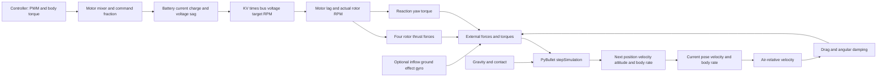

# Module 6: Complete drone physics engine and validation

## By the end, you will be able to

- Identify every force and torque in the course drone model.
- Explain where each effect comes from and how it changes flight.
- Distinguish a physical force from a model property such as mass or inertia.
- Validate gravity, lift, attitude torque, drag, and wind before tuning a controller.

---

## The complete physics path

Module 6 is the capstone for the physical model built in Modules 1–5. A flight
controller asks for motor commands; the engine turns them into forces and
torques; PyBullet advances the rigid body to its next state.

```mermaid
flowchart LR
    command[Controller: PWM and body torque] --> mixer[Motor mixer and command fraction]
    mixer --> battery[Battery current charge and voltage sag]
    battery --> kv[KV times bus voltage target RPM]
    kv --> motor[Motor lag and actual rotor RPM]
    motor --> thrust[Four rotor thrust forces]
    motor --> reaction[Reaction yaw torque]
    state[Current pose velocity and body rate] --> air[Air-relative velocity]
    air --> drag[Drag and angular damping]
    optional[Optional inflow ground effect gyro] --> forces
    thrust --> forces[External forces and torques]
    reaction --> forces
    drag --> forces
    forces --> bullet[PyBullet stepSimulation]
    gravity[Gravity and contact] --> bullet
    bullet --> next[Next position velocity attitude and body rate]
    next --> state
```

The state is position, linear velocity, orientation, and body angular velocity.
Mass and inertia decide how strongly a given force or torque changes that state.

---

## Forces

| # | Effect | Basic model | Priority |
|---|---|---|---|
| 1 | **Gravity** | \(F_g = mg\) | Essential |
| 2 | **Motor thrust** | \(\mathrm{RPM}_{target}=uK_VV_{bus}\), \(T_i=k_T\mathrm{RPM}_{actual}^2\) | Essential |
| 3 | **Motor reaction torque** | \(\tau_i=k_Q\mathrm{RPM}_{actual}^2\) | Essential |
| 4 | **Roll/pitch torque from thrust** | \(\tau_i=r_i\times F_i\) | Essential |
| 5 | **Quadratic body drag** | \(F_D=-\frac{1}{2}\rho C_D A\lvert v_{air}\rvert v_{air}\) | Essential |
| 6 | **Rotor-dependent linear drag** | \(F_D=-k_r\sum_i\omega_i v_{air}\) | Essential |
| 7 | **Angular/rotational damping** | \(\tau_D=-k_\omega\omega\) | Recommended |
| 8 | **Motor dynamics** | \(\dot\omega=(\omega_{cmd}-\omega)/\tau_m\) | Recommended |
| 9 | **Rotor inflow / blade flapping** | modifies thrust and in-plane force | Optional |
| 10 | **Propeller gyroscopic torque** | \(\tau_g=\Omega\times H\) | Optional |
| 11 | **Wind** | use \(v_{air}=v_{drone}-v_{wind}\) | Recommended |
| 12 | **Ground effect** | thrust increase near ground | Optional |
| 13 | **Prop wash / induced airflow (not implemented)** | modifies local airflow | Advanced |

## Force inventory

| Force or effect | Physical source | Contribution to flight | Engine status | Detailed lesson |
| --- | --- | --- | --- | --- |
| Gravity | Earth attracts the drone mass. | Weight pulls down; level hover needs total thrust equal to `mg`. | PyBullet gravity | [Module 1: mass and weight](../01-mass-and-forces/index.md#mass-and-weight) and [free fall](02-drone-free-fall/index.md) |
| Rotor thrust | Propellers accelerate air downward. | Four upward rotor forces create lift; a tilted lift vector accelerates the drone sideways. Battery voltage and KV set the RPM available for this force. | Active | [Module 3: motor KV](../03-propeller-aerodynamics/motor-kv/index.md) and [Module 5: battery sag](../05-battery-voltage-sag/index.md) |
| Lever-arm roll and pitch torque | Different rotor thrusts act away from the centre of mass. | Rotates the drone to roll or pitch; lower available thrust also lowers available attitude torque. | Active | [Module 2: force and torque](../02-urdf-engine/index.md#force-center-of-mass-and-torque) and [Module 4 mixer](../04-motor-mixer-pid/index.md#x-frame-mixing) |
| Rotor reaction yaw torque | Each spinning propeller twists the frame in the opposite direction. | CW/CCW pairs cancel in hover; unequal pairs turn yaw. Lower RPM also lowers yaw authority. | Active | [Module 3: motor KV](../03-propeller-aerodynamics/motor-kv/index.md) |
| Rotor-dependent linear drag | Spinning rotors interact with air moving through the body frame. | Slows translation; it falls when voltage or KV produces lower total rotor RPM. | Active | [Module 4: relative air velocity and drag](../04-motor-mixer-pid/index.md#relative-air-velocity-and-drag) |
| Quadratic body drag | Air pushes on the frame, arms, battery, and camera. | Opposes air-relative motion, limiting forward and vertical speed. | Active | TBD — planned aerodynamics lesson |
| Wind-relative airspeed | Moving air changes the velocity seen by the airframe. Wind itself is not a standalone force. | Changes drag direction and magnitude; a crosswind causes drift through drag. | Active, zero wind by default | [Module 4: crosswind experiment](../04-motor-mixer-pid/index.md#crosswind-experiment) |
| Angular damping | Air resists roll, pitch, and yaw rates. | Reduces rotational overshoot and helps the body stop rotating. | Active | TBD — planned aerodynamics lesson |
| Rotor inflow and blade flapping | Forward airspeed changes flow through the rotor disk and blade lift. | Can reduce thrust and add in-plane resistance during fast flight. | Optional, off | TBD — planned advanced aerodynamics lesson |
| Ground effect | Downwash is constrained near a surface below a rotor. | Increases effective lift near the ground or a surface. | Optional, off | TBD — planned takeoff and landing lesson |
| Gyroscopic torque | Rotors carry angular momentum while the body rotates. | Couples body rotation with unequal rotor speeds; its size also falls with RPM. | Optional, off | TBD — planned advanced attitude lesson |
| Contact normal and friction | Ground or target collision geometry pushes back against penetration. | Stops or redirects the drone at ground/target contact. | PyBullet contact solver | [Module 1: free fall and contact](../01-mass-and-forces/01-free-fall/index.md) |

---

## Lift and drag in this drone

For a quadcopter, **rotor thrust is lift**. There is no fixed wing creating a
separate lift force: each propeller pushes air down and receives an upward
reaction. When the drone pitches or rolls, the same thrust vector tilts, so one
part holds altitude and another part accelerates the drone sideways.

**Drag** is air resistance. It points opposite the drone's velocity relative to
the air, so a headwind increases drag and a tailwind reduces it. Wind changes
the air-relative velocity; it is not an extra force by itself.

| Effect | Role in lift or drag | Contribution |
| --- | --- | --- |
| Rotor thrust | Lift | The four upward propeller forces support weight and, when tilted, create forward or sideways acceleration. |
| Quadratic body drag | Translational drag | Air pushes against the frame, arms, battery, and camera; it limits forward, sideways, and vertical speed. |
| Rotor-dependent linear drag | Translational drag | The course's simpler rotor-air resistance model also opposes body-relative motion. |
| Blade flapping | Optional in-plane drag | Fast horizontal airflow across a rotor creates a force opposing that motion. |
| Rotor inflow | Lift modifier | Forward airflow through the propeller disk can reduce thrust at the same RPM. |
| Ground effect | Lift modifier | Restricted downwash near a surface can increase effective rotor thrust. |
| Angular damping | Rotational drag | Air resists roll, pitch, and yaw rate rather than linear motion. |

---

## Model inputs that are not forces

| Model input | Why it matters | Defined in |
| --- | --- | --- |
| Mass | Converts net force to linear acceleration through `F = ma`. | Drone model and URDF |
| Inertia tensor | Converts net torque to roll, pitch, and yaw acceleration. | URDF inertial block |
| Rotor positions | Set each thrust force's lever arm and torque authority. | Drone model and URDF rotor links |
| Battery voltage and motor KV | Battery current, charge, and resistance determine \(V_{bus}\); KV turns it into the available motor RPM. It therefore limits thrust and all RPM-dependent torques. | Vehicle profile YAML and `BatteryModel` |
| Motor time constant | Delays RPM and therefore thrust after a PWM change. | Drone model |
| Physics timestep | Sets the 240 Hz integration interval and the 120 Hz control interval. | Physics settings |
| Collision shape | Decides where PyBullet can create contact forces. | URDF collision geometry |

---

## Modules that define or calculate forces

| Module | Responsibility |
| --- | --- |
| `examples/common/drone_physics.py` | Calculates and applies thrust, reaction torque, drag, damping, and optional aerodynamic effects. |
| `examples/common/drone_model.py` | Defines mass, actuator constants, force coefficients, wind, and optional-force settings. |
| `examples/common/battery.py` | Calculates calibrated pack current, state of charge, voltage sag, and the RPM command scale. |
| `examples/common/pybullet_utils.py` | Defines world gravity and creates the PyBullet physical world. |
| `examples/common/assets/full_drone.urdf` | Defines mass, inertia, rotor locations, and collision geometry used by PyBullet. |

---

## Capstone lessons

1. [Step 1: Initialize the simulation environment](01-initialize-environment/index.md)
2. [Step 2: Drone free fall](02-drone-free-fall/index.md)
3. [Drone hover capstone](03-drone-hover/index.md)
4. [Step 5: Physics-engine validation](05-physics-engine-validation/index.md)

The hover capstone turns this force inventory into a controlled flight. The
validation lesson tests individual predictions before controller gains are
tuned.

---

Prerequisite: [Module 5: Battery voltage sag](../05-battery-voltage-sag/index.md).
Next: [Module 7: Optical navigation](../07-optical-navigation/index.md).
