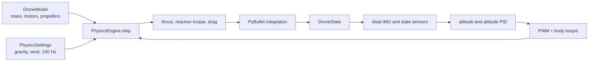
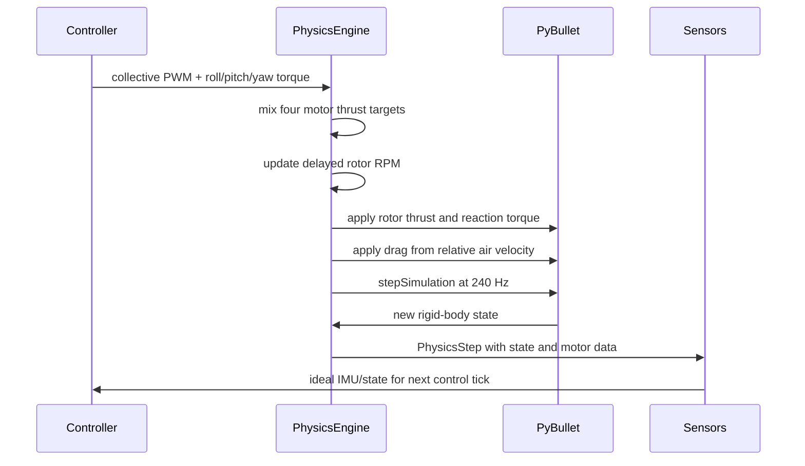

# Module 6 capstone: validated drone physics engine

This capstone combines the course's mass, thrust, torque, propeller, motor,
drag, wind, sensor, and PID lessons into one reusable quadcopter simulation.
The final hover controller is meaningful only after the physics engine passes
independent validation tests.

## By the end, you will be able to

- Describe the complete rigid-body state used by the simulator.
- Explain how `DroneModel`, `PhysicsEngine`, PyBullet utilities, and sensors work together.
- Run and interpret seven gravity, force, torque, and wind validations.
- Use the validated model as the foundation for autonomous takeoff and hover.



---

## Complete drone state

Each engine step exposes the state:

$$\mathbf{x}=[\mathbf{p},\mathbf{v},\mathbf{q},\boldsymbol{\omega}],$$

where:

- \(\mathbf{p}\) is world position in metres.
- \(\mathbf{v}\) is world linear velocity in m/s.
- \(\mathbf{q}\) is attitude as a quaternion.
- \(\boldsymbol{\omega}\) is body angular velocity in rad/s.

The simulator uses PyBullet for rigid-body numerical integration. The course
engine owns the drone-specific part: motors, propellers, force mixing, drag,
wind, and the order in which they are applied.

---

## Module responsibilities

| Module | What it owns | Main interface |
| --- | --- | --- |
| `drone_model.py` | Drone constants, physics settings, typed state and step results | `DroneModel`, `PhysicsSettings`, `DroneState`, `PhysicsStep` |
| `pybullet_utils.py` | World setup, reset, force vectors, status text | `create_world()`, `reset_drone()`, `draw_force_vectors()` |
| `pybullet_sensors.py` | Ideal state, IMU, and frame transforms | `read_state()`, `read_imu()`, `world_to_body_vector()` |
| `drone_physics.py` | Motors, mixer, thrust, torque, drag, wind, integration tick | `PhysicsEngine.reset()`, `PhysicsEngine.step()` |
| `flight_control.py` | Attitude PIDs above the physics layer | `AttitudeController.update()`, `reset()` |

`PhysicsEngine.step()` is the important seam. A caller supplies a collective
PWM command and desired body torque, then receives one typed `PhysicsStep`:

```python
step = engine.step(drone, collective_pwm_us, body_torque_nm)
print(step.total_thrust_n, step.motor_rpms, step.state.position_m)
```

The engine hides motor lag, motor mixing, thrust conversion, reaction torque,
drag, wind-relative velocity, and the PyBullet tick behind that one call.

---

## One physics tick



The force path is:

$$\mathrm{PWM}\rightarrow\mathrm{RPM}\rightarrow T_i=K_f\mathrm{RPM}_i^2,$$

$$\boldsymbol{\tau}_i=\mathbf{r}_i\times\mathbf{F}_i,$$

$$Q_i=K_m\mathrm{RPM}_i^2.$$

For drag, the engine first finds relative air velocity:

$$\mathbf{v}_{air}=\mathbf{v}_{drone}-\mathbf{v}_{wind},$$

then applies a body-frame force opposite that flow.

---

## Validate the engine before hover

Run all seven checks:

```bash
uv run python examples/06-autonomous-hover/physics_engine_validation.py --headless
```

The run prints measurements and saves:

```text
outputs/physics_engine_validation.png
```

| Validation | Controlled command | Expected observation |
| --- | --- | --- |
| Gravity | Motors off | Vertical acceleration near \(-9.81\ \mathrm{m/s^2}\) |
| Hover | Equal hover PWM | Altitude error remains near zero |
| Vertical acceleration | Equal PWM above hover | Positive vertical velocity |
| Roll | Positive left/right torque request | Positive roll rate |
| Pitch | Positive front/rear torque request | Positive pitch rate |
| Yaw | CW/CCW torque request | Positive yaw rate with nearly unchanged collective thrust |
| Wind | 5 m/s crosswind with hover PWM | Positive lateral drift |

Run only one case when studying it:

```bash
uv run python examples/06-autonomous-hover/physics_engine_validation.py \
  --headless --scenario yaw --no-plot
```

The plot is a compact result summary. Read each value with its printed unit;
gravity is acceleration, hover is altitude error, vertical is speed, attitude
checks are angular speed, and wind is lateral displacement.

---

## Hands-on: change one physical cause

Run the hover case first, then change exactly one input and predict what the
measurement will do before you run it:

```bash
uv run python examples/06-autonomous-hover/physics_engine_validation.py \
  --headless --scenario wind
```

Now change `wind_world_mps` in `wind_validation()` from `(0, 5, 0)` to
`(0, -5, 0)`. The measured lateral drift should reverse sign. Reset the value
after the experiment so the suite remains its shared reference.

---

## The final hover capstone

The existing hover examples now use the validated engine rather than managing
motor RPM tuples themselves:

```text
barometer/state → altitude PID → collective force → PWM
IMU → attitude PID → body torque
PWM + torque → PhysicsEngine.step() → next state
```

Run the capstone flight:

```bash
uv run python examples/06-autonomous-hover/auto_takeoff_and_hover.py
uv run python examples/06-autonomous-hover/auto_takeoff_and_hover.py --headless
```

It climbs to 3 m, holds altitude, turns 180°, then lands. The altitude PID
adds a force correction to weight, while the attitude controller makes small
motor-to-motor differences to keep the airframe level or turn it.

---

## Review quiz

<form class="quiz" data-answer="b" data-explanation="PhysicsEngine.step owns the motor/force work and advances PyBullet one tick, returning the resulting state.">
  <fieldset><legend>1. What is the main job of PhysicsEngine.step()?</legend><label><input type="radio" name="capstone-q1" value="a"> Draw only the GUI</label><br><label><input type="radio" name="capstone-q1" value="b"> Apply drone forces and advance one physics tick</label><br><label><input type="radio" name="capstone-q1" value="c"> Choose a mission target</label></fieldset><button type="button" class="quiz-check">Check answer</button><p class="quiz-result" aria-live="polite"></p>
</form>
<form class="quiz" data-answer="a" data-explanation="The wind model uses relative air velocity, so drag responds to both drone motion and moving air.">
  <fieldset><legend>2. Why does the engine subtract wind from drone velocity?</legend><label><input type="radio" name="capstone-q2" value="a"> Drag depends on motion relative to air</label><br><label><input type="radio" name="capstone-q2" value="b"> Wind removes gravity</label><br><label><input type="radio" name="capstone-q2" value="c"> It changes kilograms into newtons</label></fieldset><button type="button" class="quiz-check">Check answer</button><p class="quiz-result" aria-live="polite"></p>
</form>
<form class="quiz" data-answer="c" data-explanation="Independent physics checks keep a PID from hiding a wrong force or torque model.">
  <fieldset><legend>3. Why validate gravity, hover, torque, and wind before tuning hover?</legend><label><input type="radio" name="capstone-q3" value="a"> To make the code longer</label><br><label><input type="radio" name="capstone-q3" value="b"> To avoid using sensors</label><br><label><input type="radio" name="capstone-q3" value="c"> To find physics errors before the controller hides them</label></fieldset><button type="button" class="quiz-check">Check answer</button><p class="quiz-result" aria-live="polite"></p>
</form>

---

Back to [Module 6 overview](../index.md). Previous: [Module 5: Battery voltage sag](../../05-battery-voltage-sag/index.md). Next: [Module 7: Optical navigation](../../07-optical-navigation/index.md).
