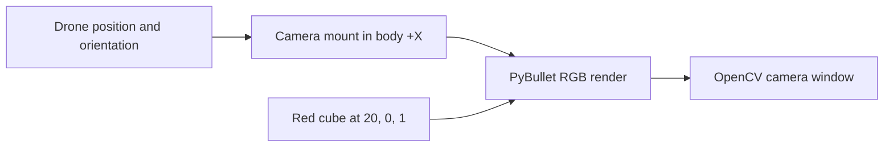

# Module 7: Forward camera and monocular optical navigation

## By the end, you will be able to

- Attach a forward-facing RGB camera to the simulated drone body.
- Estimate real optical flow between consecutive camera frames.
- Explain why monocular optical flow measures relative image motion, not metric
  distance by itself.

---

## Forward RGB camera

`forward_camera.py` adds a camera 18 cm ahead of the drone in its body-frame
`+X` direction. It holds the vehicle near 3 m with the familiar Module 6 PID
loop and uses OpenCV to show the camera's RGB frame in a separate window.

The scene contains a static red cube centered at world position `(20, 0, 1)`.
Its `2 × 2 × 2 m` body makes a clear visual target ahead of the drone.

```bash
uv run python examples/07-optical-navigation/forward_camera.py
```

Press `q` or `Esc` in the OpenCV camera window to stop the example. The
PyBullet window shows the same drone physics and green rotor-force arrows.



---

## HSV red-target detector

`red_target_detector.py` uses the same camera and cube, but converts each RGB
frame to HSV. Red wraps around the hue scale, so the detector combines a low
red hue range with a high red hue range. It selects the largest red contour and
draws a yellow bounding box around it.

```bash
uv run python examples/07-optical-navigation/red_target_detector.py
```

The label reports the bounding-box width and height in pixels. Those values are
image measurements, not the cube's distance or world size.

---

## TTC diagonal-strike POC

`ttc_diagonal_strike.py` takes the drone to 15 m, then uses red-bbox scale
growth to estimate time to contact. A simulated barometer supplies altitude and
vertical velocity; TTC synchronises the descent to the known impact altitude.
Roll and yaw remain fixed at zero.

```bash
uv run python examples/07-optical-navigation/ttc_diagonal_strike.py
```

The display labels the current takeoff, track, commit, or abort phase with the
latest TTC, bbox growth, velocity commands, pitch, and thrust. During commit,
the last valid pitch and throttle are deliberately held after a large target
leaves the image. The complete design is recorded in
`design/ttc_bbox_diagonal_strike.md`. The implementation guide, full
configuration reference, and TTC-to-control diagrams live beside the code in
`examples/07-optical-navigation/ttc_strike/README.md`.

Each run creates a folder under `outputs/ttc_runs/` containing `settings.json`,
`telemetry.csv`, and `telemetry.png` (plus the environment video unless
disabled). The CSV includes phase, measured velocity, pitch target/measured
pitch, TTC, bbox growth, and thrust. Use it to separate the initial
forward-acceleration interval from the later TTC descent. The folder also
contains `summary.json` with the starting pose, target pose, collision position,
incoming hitting velocity, and flight extrema.

---

## Flight summary and environment video

The strike example starts PyBullet in a wide view so the launch point, diagonal
path, target, and three distant static buildings are visible together. A fixed
environment camera records that same full scene in the run folder. After its first cube contact, the
motors stop, physics continues for three simulated seconds, then the program
prints the contact result, final phase, simulated duration, impact speed, video
path, and environment contents. It also saves `telemetry.png`
with actual `vx`/`vz`, world `x`–`z` path, `TrajectoryCommand` targets, and
`GuidanceCommand` collective thrust plus pitch target in degrees. PyBullet uses
`z` as its vertical axis, so the path is the physical equivalent of an
`x`–vertical-position plot. In a GUI run, the same graph opens in a separate
Matplotlib window at startup and updates while the simulation runs. When the
flight ends, the tracking shade stops at the collision marker; the
`TrajectoryCommand` panel remains unshaded. The application exits normally and
leaves the final PNG and JSON summary behind.

```bash
uv run python examples/07-optical-navigation/ttc_diagonal_strike.py --video outputs/my-strike.mp4
```

Use `--no-video` when only the live PyBullet and forward-camera views are
needed. Use `--plot outputs/my-strike.png` to choose the plot location, or
`--no-plot` to skip it.

---

## Module achievement

This first camera example establishes the visual sensor path: body pose to RGB
frame. The next lesson will compare consecutive images with optical flow and
turn changing pixels into a relative-motion estimate. That signal can later
support navigation without directly reading perfect world position from
PyBullet.

## Hands-on

Move the cube farther along `+X`, then change the drone's yaw target in the
example. Observe how the cube moves across the camera image while the world
object itself remains fixed.

## Review questions

1. Why must the camera pose rotate with the drone body?
2. Which world position and size define the red cube?
3. Why does the HSV detector use two hue ranges for red?
4. Why can an RGB frame show relative motion without revealing metric distance?

---

Prerequisite: [Module 6: Autonomous hover](../06-autonomous-hover/index.md).
Next: [Module 8: Betaflight SITL bridge](../08-betaflight-sitl/index.md).
