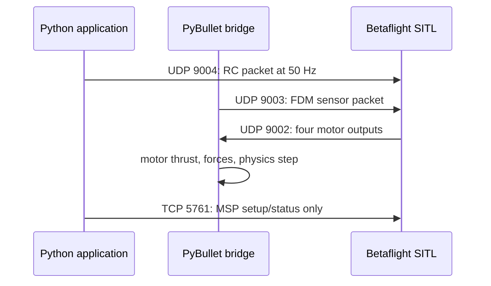

# Lesson 1: PyBullet to Betaflight bridge protocol

This lesson prepares the wire connection before we let Betaflight fly the
PyBullet drone. PyBullet supplies the vehicle and sensors. Betaflight supplies
the low-level attitude controller and motor mixer. Your application sends
virtual stick commands.

## By the end, you will be able to

- Name the UDP and TCP ports used by the pinned SITL bridge.
- Explain which system owns physics, flight control, and pilot commands.
- Read the FDM, motor, and virtual-RC packet roles without memorizing every byte.
- Provision the repeatable QUADX Angle-mode SITL configuration.



---

## One responsibility for each system

| System | Owns | Does not own |
| --- | --- | --- |
| PyBullet | rigid-body motion, gravity, drag, motor forces, virtual sensors | PID tuning or motor mixing decisions |
| Betaflight SITL | gyro/attitude control, rate control, QUADX motor mixing | PyBullet forces or URDF motion |
| Application | pilot-style roll, pitch, yaw, throttle, arm, and mode request | direct motor thrust |
| MSP connection | configuration, status, diagnostics | live flight-stick stream |

This boundary matters: sending force directly from the application would bypass
the flight controller. The bridge instead gives Betaflight sensor measurements,
then applies the four motor values it returns.

---

## Pinned version and ports

The course pins [Betaflight `2026.6.2`](https://github.com/betaflight/betaflight/releases/tag/2026.6.2), commit `e0b7bb0`. Packet shapes are part of that version contract.

| Port | Direction | Packet | First use |
| --- | --- | --- | --- |
| UDP `9003` | PyBullet bridge → SITL | FDM sensor packet | simulated IMU and barometer |
| UDP `9002` | SITL → PyBullet bridge | four normalized motor outputs | rotor thrust requests |
| UDP `9004` | application → SITL | 16-channel virtual RC packet | arm, Angle mode, sticks |
| TCP `5761` | bridge ↔ SITL | MSP / CLI | configuration and status |

The upstream [SITL packet reference](https://betaflight.com/docs/development/autopilot/SITL_Autopilot_Testing_Gazebo) defines these ports. `9001` also exists for raw PWM diagnostics, but this first bridge does not use it.

---

## The three messages

### FDM sensor packet: UDP 9003

The bridge packs 18 little-endian `double` values, so one packet is 144 bytes.
It contains timestamp, body angular velocity, body specific force, quaternion
in `[w, x, y, z]` order, velocity, position, and barometric pressure.

The first configuration activates IMU and barometer behavior. Position and
velocity are still populated because the packet layout requires them, but GPS
and navigation modes stay disabled.

### Motor packet: UDP 9002

Betaflight returns four little-endian `float` values, 16 bytes total. Each is a
normalized motor command from `0.0` to `1.0`. The future motor adapter will use
the fixed QUADX-to-URDF order and the course's existing squared command-to-thrust
model. It will not route these values through the Module 6 PID or mixer.

### Virtual RC packet: UDP 9004

The application sends one little-endian `double` timestamp followed by sixteen
`uint16` channels, 40 bytes total. The first four use AETR ordering:

| Channel | Meaning | Neutral / low value |
| --- | --- | --- |
| A | roll | `1500` µs |
| E | pitch | `1500` µs |
| T | throttle | `1000` µs before arming |
| R | yaw | `1500` µs |
| AUX1 | arm | high means arm |
| AUX2 | Angle mode | high means self-level |

Send this packet every 20 ms (50 Hz). If it stops, the course configuration
uses `DROP` failsafe, which disarms rather than preserving the last throttle.

---

## Quiz: find the motor path

<form class="quiz" data-answer="b" data-explanation="Betaflight sends four normalized motor outputs on UDP 9002; the bridge converts them to forces and PyBullet integrates the motion.">
  <fieldset>
    <legend>Which path carries motor commands from Betaflight to PyBullet?</legend>
    <label><input type="radio" name="sitl-q1" value="a"> TCP 5761 MSP status messages.</label><br>
    <label><input type="radio" name="sitl-q1" value="b"> UDP 9002 normalized motor packet.</label><br>
    <label><input type="radio" name="sitl-q1" value="c"> UDP 9004 virtual RC packet.</label>
  </fieldset>
  <button type="button" class="quiz-check">Check answer</button>
  <p class="quiz-result" aria-live="polite"></p>
</form>

---

## Frames and sensors need an adapter

PyBullet reports a world-frame position in metres, a quaternion in `[x, y, z,
w]` order, and world velocity. Betaflight’s FDM packet expects body-frame IMU
measurements and a quaternion in `[w, x, y, z]` order. This is why the future
`FdmEncoder` owns all frame conversion in one place.

Before a flight can be trusted, it must pass three known-pose checks:

1. A level, motionless drone sends zero body rate and the expected gravity-only
   specific-force measurement.
2. A drone yawed by 90° has rotated body axes but unchanged world altitude.
3. A known roll or pitch rotation produces the expected signed body rate and
   accelerometer direction.

Do not fix a wrong axis sign by changing Betaflight PID values. First prove the
adapter against these simple states.

---

## Quiz: who controls the motors?

<form class="quiz" data-answer="c" data-explanation="The application provides sticks, Betaflight calculates motor commands, and PyBullet applies their physical forces.">
  <fieldset>
    <legend>Who should turn a roll command into four motor outputs?</legend>
    <label><input type="radio" name="sitl-q2" value="a"> The application.</label><br>
    <label><input type="radio" name="sitl-q2" value="b"> The PyBullet URDF.</label><br>
    <label><input type="radio" name="sitl-q2" value="c"> Betaflight SITL.</label>
  </fieldset>
  <button type="button" class="quiz-check">Check answer</button>
  <p class="quiz-result" aria-live="polite"></p>
</form>

---

## Configure the pinned SITL

Build the exact source tag once. This does not install a prebuilt binary from
an unknown source:

```bash
tools/setup_betaflight_sitl.sh
```

Then create a fresh, course-configured EEPROM:

```bash
tools/provision_betaflight_sitl.sh
```

The provisioner refuses to run if another SITL or simulator already owns UDP
`9003`/`9004` or TCP `5761`. Stop that process first; two simulators sharing
these fixed ports can exchange the wrong sensor packets. Verbose Betaflight
EEPROM output is saved in `.sitl/course-angle-mode/provision.log`.

The versioned configuration at
`examples/08-betaflight-sitl/config/course_angle_mode.config` sets:

| Setting | Reason |
| --- | --- |
| `mixer QUADX` | fixes the four-motor X-frame mixer |
| `map AETR1234` | gives the application a known channel order |
| AUX1 arm | makes arming explicit |
| AUX2 Angle | gives the first flight self-leveling |
| `failsafe_procedure = DROP` | RC loss disarms the vehicle |

Run SITL after provisioning:

```bash
tools/run_betaflight_sitl.sh
```

It listens for future FDM packets on UDP `9003` and opens MSP on TCP `5761`.

---

## Quiz: why provision a fresh EEPROM?

<form class="quiz" data-answer="a" data-explanation="Betaflight stores settings in eeprom.bin. Recreating it from the versioned config prevents old receiver or mode settings from changing the lesson.">
  <fieldset>
    <legend>Why does the provision script remove the old `eeprom.bin` first?</legend>
    <label><input type="radio" name="sitl-q3" value="a"> To prevent stale settings from changing the repeatable course setup.</label><br>
    <label><input type="radio" name="sitl-q3" value="b"> To increase PyBullet physics speed.</label><br>
    <label><input type="radio" name="sitl-q3" value="c"> To change the drone mass.</label>
  </fieldset>
  <button type="button" class="quiz-check">Check answer</button>
  <p class="quiz-result" aria-live="polite"></p>
</form>

---

## Check packet layouts before networking

Run the small protocol check before opening sockets:

```bash
uv run python examples/08-betaflight-sitl/protocol_self_check.py
```

It verifies the three binary layouts and rejects bad RC or motor values. It
does not start SITL or make the drone fly.

### Quiz: what is MSP for here?

<form class="quiz" data-answer="b" data-explanation="UDP virtual RC is the real-time pilot stream. MSP is the slower control plane for configuration, status, and diagnostics.">
  <fieldset>
    <legend>What is TCP 5761 MSP used for in this bridge?</legend>
    <label><input type="radio" name="sitl-q4" value="a"> Streaming motor commands every physics step.</label><br>
    <label><input type="radio" name="sitl-q4" value="b"> Configuration, status, and diagnostics.</label><br>
    <label><input type="radio" name="sitl-q4" value="c"> Replacing the virtual RC stream.</label>
  </fieldset>
  <button type="button" class="quiz-check">Check answer</button>
  <p class="quiz-result" aria-live="polite"></p>
</form>

---

## Hands-on

1. Run the protocol self-check and match each printed byte size to the port table.
2. Read the Angle-mode config. Which AUX channel would you set high to arm?
3. Explain why sending no RC packets must stop the motors instead of keeping the last throttle.

Next: implement the `FdmEncoder`, `RcCommand`, and motor-output adapter, then
prove frame signs before allowing the first closed-loop PyBullet flight.
