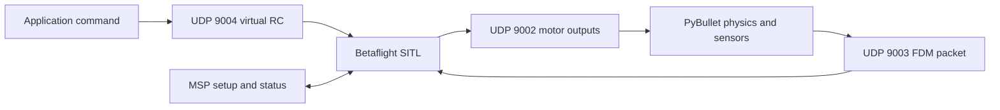

# Module 8: Betaflight SITL control bridge

## By the end, you will be able to

- Build a pinned Betaflight SITL version for a reproducible simulation setup.
- Exchange simulated state, virtual RC input, and four motor commands over the
  SITL bridge.
- Arm, hover, yaw, and land the PyBullet drone through an Angle-mode controller.

---

---

## Module achievement

This planned module connects the existing PyBullet drone physics to Betaflight
software-in-the-loop. PyBullet remains responsible for rigid-body physics and
rotor forces; Betaflight becomes the flight controller that receives simulated
sensor state and returns motor commands.

The final demonstration is a controlled virtual-RC flight: arm the drone,
hover, yaw, and disarm or land through the bridge. Before that flight lesson,
we pin the SITL release, prove the packet layout, and make the flight-controller
configuration reproducible.

---

## Foundation lesson

[Bridge protocol and SITL setup](bridge-protocol/index.md) explains the
Betaflight 2026.6.2 ports, packet ownership, frames, native setup script, and
the checked-in Angle-mode configuration.

---

Prerequisite: [Module 7: Optical navigation](../07-optical-navigation/index.md).
Next: [Module 9: Learned vertical hover](../09-mlp-hover/index.md).
