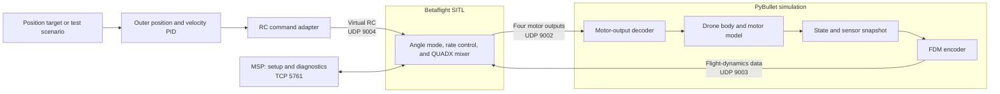
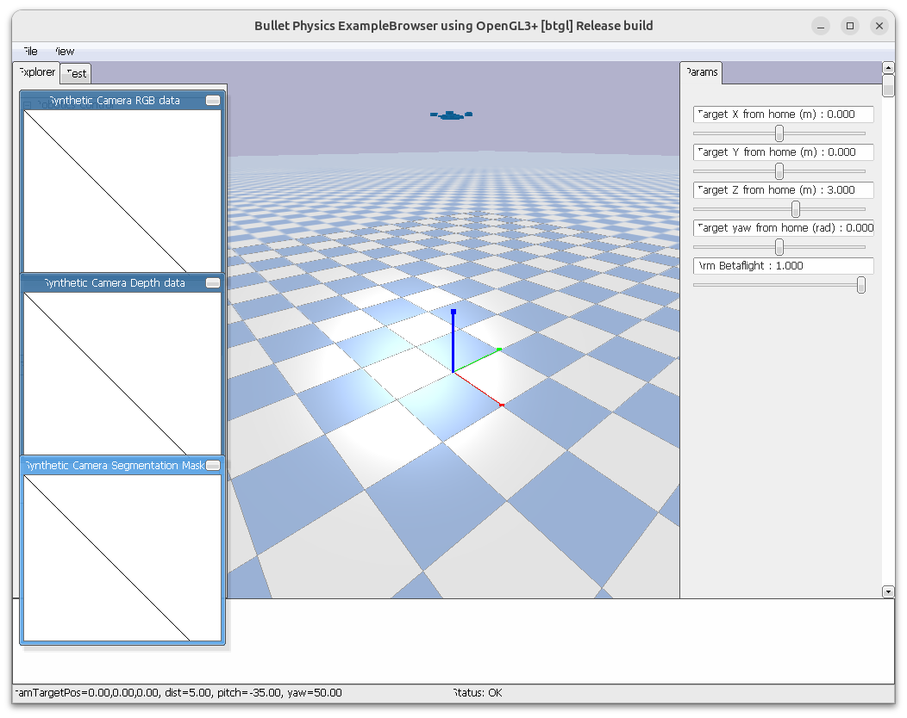

# Betaflight SITL bridge design

## Purpose

This document explains how Betaflight Software-in-the-Loop (SITL) fits inside
the PyBullet simulation. The bridge connects two independently running
systems:

- **PyBullet** is the flight-dynamics simulator. It owns the drone body,
  gravity, motor lag, rotor forces, reaction torque, and motion. The current
  standalone plant has no aerodynamic drag model.
- **Betaflight SITL** is the embedded low-level flight controller. It consumes
  simulated sensor data and returns four motor commands.

The bridge does not move the drone or create forces. It translates data between
these two systems and protects their ownership boundary.

---

## System boundary



The first bridge keeps the current Module 04 position and velocity PID loops
as an **outer** controller. They read raw PyBullet state and turn a
home-relative XYZ target and yaw heading into pilot-style RC commands.
Betaflight then owns the inner Angle-mode attitude loop, body-rate loop, and
QUADX motor mixer.

Therefore, a SITL flight must disable the local Module 04 attitude controller,
body-rate controller, and `Mixer.mix()` path. PyBullet's motor lag,
RPM-to-thrust calculation, `apply_motor_forces()`, and `p.stepSimulation()`
remain active.

---

## Interfaces

| Interface | Sender → receiver | Purpose |
| --- | --- | --- |
| Virtual RC | Python scenario → Betaflight SITL | Carries pilot-style roll, pitch, throttle, yaw, arm, and flight-mode intent. |
| Flight dynamics model (FDM) | PyBullet bridge → Betaflight SITL | Carries the simulated motion and sensor observations that Betaflight needs to control the vehicle. |
| Motor output | Betaflight SITL → PyBullet bridge | Carries one normalized command for each QUADX motor. |
| MSP control plane | Bridge ↔ Betaflight SITL | Carries setup, configuration, status, and diagnostics; it is not the real-time flight-control path. |

### Virtual RC message

The outer controller does not command motors. It emits a `PilotCommand` that
the RC adapter encodes as the 16-channel virtual RC packet.

| Field | Meaning |
| --- | --- |
| `roll`, `pitch` | Requested lean direction and magnitude. Betaflight Angle mode turns these into attitude targets. |
| `throttle` | Normalized collective RC throttle computed by the outer position/velocity controller. |
| `yaw` | Requested yaw rate. An outer yaw-heading controller converts heading error into this value. |
| `armed` | Whether the vehicle may arm. |
| `angle_mode` | Whether Betaflight should use its self-leveling Angle mode. |
| `timestamp` | Time associated with the command. |

The pinned wire format is UDP port `9004`, with a timestamp followed by sixteen
unsigned 16-bit RC channels in AETR order. The bridge sends it at 50 Hz.

### Flight-dynamics message

PyBullet produces a `FlightObservation`. The FDM encoder converts it to the
format Betaflight expects.

| Field | Source in PyBullet | Meaning at the interface |
| --- | --- | --- |
| `timestamp` | Simulation clock | Time of the observation. |
| `body_rates` | Base angular velocity | Angular velocity in body axes. |
| `specific_force` | Motion and gravity | Accelerometer measurement; it is not raw world acceleration. |
| `quaternion_wxyz` | Base orientation | Orientation, reordered from PyBullet XYZW to WXYZ. |
| Reserved velocity slots | Constant zeros | Three doubles kept only for packet compatibility. |
| Reserved position slots | Constant zeros | Three doubles kept only for packet compatibility. |
| `pressure_pa` | Simulated altitude | Barometric pressure in pascals. |

The pinned wire format is UDP port `9003`: eighteen little-endian `double`
values, or 144 bytes. It is sent at the 240 Hz physics cadence. The course
bridge does not use the packet position fields for navigation: its outer PID
reads home-relative PyBullet base odometry directly. It sends six reserved
zeros for velocity/position. The course-patched receiver reads `pressure_pa`
directly and skips virtual GPS updates. Rebuild using the setup script before
using this encoder with SITL.

The pinned SITL binary uses its Gazebo FDM convention. Its gyro input uses the
Gazebo IMU frame, while its acceleration driver negates all three received
axes before passing data to the estimator. The FDM encoder treats those as two
separate conversions: body rates use `(x, -y, -z)` and specific force uses
`(-x, -y, -z)`. It also converts the PyBullet XYZW attitude into the
corresponding packet quaternion. Without these exact conversions, Angle mode
sees tilt or acceleration with incorrect signs and can command a rollover.

### Sensor models and noise

The bridge separates sensor modeling from PyBullet state reading. `ImuSensor`
calculates body rates and specific force, while `BarometerSensor` converts
home-relative altitude to pressure. Both classes accept constructor configs
with fixed bias and independent zero-mean Gaussian sample noise:

| Sensor | Measurement | Bias unit | Noise sigma unit |
| --- | --- | --- | --- |
| IMU gyro | Body angular rate | `rad/s` | `rad/s` |
| IMU accelerometer | Specific force | `m/s²` | `m/s²` |
| Barometer | Pressure | `Pa` | `Pa` |

For a measurement `x`, the model is `x_measured = x_true + b + n`, where
`b` is the configured bias and `n ~ N(0, σ²)`. All defaults are zero, so the
normal bridge remains deterministic. Pass a seeded `random.Random` instance
to a sensor when a repeatable noisy experiment is needed. The deterministic
model boundary is checked by
`uv run python examples/08-betaflight-sitl/sensor_self_check.py`.

### Motor-output message

Betaflight responds with a `MotorCommand` containing four normalized values in
the range `[0, 1]`.

| Field | Meaning |
| --- | --- |
| `motor[0]` through `motor[3]` | QUADX motor-output requests from Betaflight. |
| `received_at` | Local bridge time used to reject stale packets. |
| Validation | The decoder rejects wrong sizes, nonfinite values, and outputs outside `[0, 1]`; the client returns zeros for missing or stale packets. No `healthy` field exists in the current data class. |

The pinned wire format is UDP port `9002`: four little-endian `float` values,
or 16 bytes. The motor decoder maps Betaflight's fixed QUADX order to the URDF
rotor links before applying forces:

| Betaflight output | Physical position | URDF rotor link |
| --- | --- | --- |
| `motor[0]` | rear-right | `rotor_3` |
| `motor[1]` | front-right | `rotor_1` |
| `motor[2]` | rear-left | `rotor_2` |
| `motor[3]` | front-left | `rotor_0` |

PyBullet then applies motor lag, converts RPM to thrust, applies the four
rotor forces and reaction torques, and advances physics.

---

## One simulation tick

At every 240 Hz PyBullet tick, the bridge follows this order:

1. Read pre-step PyBullet state, update the outer PID at its 30/60 Hz rates,
   and send the latest virtual RC command when its 50 Hz period is due.
2. Read the latest valid `MotorCommand` from Betaflight; use zero commands if
   no valid command is available.
3. Apply the commands to PyBullet's existing per-motor lag and thrust model.
4. Advance the physics simulation once.
5. Read the resulting `FlightObservation`, encode it as FDM, and send it to
   Betaflight.

This ordering makes the motor output causal: Betaflight responds to an
observation, and PyBullet applies that response on the following physics tick.

---

## Scope of this overview

This document defines the high-level roles, interfaces, data, and direction of
flow. Packet validation, coordinate-frame tests, fixed rotor permutation,
timeout behavior, configuration, and calibration are specified in the
repository design note `design/integration/betaflight_sitl_bridge.md`.

The following are deliberately outside this first bridge overview: GPS or
navigation modes, manual motor forcing, runtime MSP flight commands, automatic
landing, and switching controllers during a flight.

---

## First implementation

The standalone implementation lives in
`examples/08-betaflight-sitl/position_bridge_demo.py`. It reuses Module 04's
outer position/velocity PID code, but does not call the local attitude/rate
controller or `Mixer.mix()`. The package below it separates messages, binary
protocol, UDP ownership, sensor conversion, outer PID/RC conversion, and the
PyBullet runner.

Run the pure checks without SITL:

```bash
uv run python examples/08-betaflight-sitl/protocol_self_check.py
uv run python examples/08-betaflight-sitl/position_bridge_demo.py --self-check
```

Build and start the pinned SITL release in a separate terminal:

For installation and restore commands, see
[Betaflight installation and configuration restore](betaflight_install.md).

```bash
tools/setup_betaflight_sitl.sh
tools/run_betaflight_sitl.sh
```

Then run the real-time PyBullet scenario:

```bash
uv run python examples/08-betaflight-sitl/position_bridge_demo.py --headless
```

The first scenario waits while disarmed, climbs to a 3 m home-relative target,
holds X/Y at the takeoff point, then disarms. It requires the fixed
ports to be unused before SITL starts.

The course configuration explicitly sets `yaw_motors_reversed = ON` to match
the URDF's rotor reaction torques and the SITL Gazebo gyro convention. The
bare SITL build defaults to OFF. After updating the course configuration,
restart with `tools/run_betaflight_sitl.sh` to provision the matching setting.
The outer yaw PID keeps the RC yaw sign because Betaflight negates that channel
internally. An extra bridge negation would reinforce yaw error.
The actual tested mode lines select both Arm and Angle on AUX1. The bridge
also sends Angle intent on AUX2, but the current configuration ties Angle to
the Arm channel. The active configuration comment now reflects those commands.
The course also uses inner yaw P=10, I=0, feedforward=0 and reduced outer yaw
gains for its 50 ms motor lag. This is a baseline for origin hover without a
constant external yaw torque; adding wind or changing the motors needs a new
control test.

With the normal SITL and bridge stopped, run the complete flight regression:

```bash
uv run python examples/08-betaflight-sitl/hover_self_check.py
```

This command provisions a temporary EEPROM and starts its own SITL process.
It holds `(0, 0, 3)` for 30 seconds, injects a `+0.5 rad/s` yaw disturbance,
and verifies altitude, horizontal position, tilt, and final yaw recovery.

### Interactive simulation
For interactive home-relative control, start SITL as above, then run:

```bash
uv run python examples/08-betaflight-sitl/slider_bridge_demo.py
```

The PyBullet GUI exposes `Target X`, `Target Y`, `Target Z`, and `Target yaw`
sliders plus an explicit `Arm Betaflight` slider. Set a target first, then move
the arm slider to `1`. The bridge sends one second of disarmed, low-throttle RC
followed by one second of armed, low-throttle RC before the outer PID commands
hover thrust. Set the slider back to `0` before closing the GUI. Press `Esc`
to disarm and exit the bridge.

To arm and climb to 3 m automatically before interactive adjustments, run:

```bash
uv run python examples/08-betaflight-sitl/slider_bridge_demo.py --auto-takeoff
```



---

## Follow-on design topics

The next design documents should refine one boundary at a time:

1. **FDM frame adapter:** prove the body/world axis convention, quaternion
   order, and specific-force calculation with known poses.
2. **Motor adapter:** prove the Betaflight QUADX-to-URDF rotor permutation and
   normalized-command-to-RPM/thrust conversion one motor at a time.
3. **Outer PID to RC adapter:** define the bounded conversion from position,
   velocity, altitude, and yaw-heading errors to Angle-mode RC sticks.
4. **Bridge health and lifecycle:** define arming, packet freshness, timeout,
   disarm, and shutdown behavior.
5. **Deterministic flight scenarios:** define repeatable arm, hover, yaw, and
   disarm experiments before adding navigation or disturbance rejection.

---

## Betaflight configuration

The checked-in `examples/08-betaflight-sitl/config/course_angle_mode.config`
replays the minimum settings used by the PyBullet bridge. Apply it when
provisioning SITL with `tools/run_betaflight_sitl.sh`, or enter the commands
manually in the Betaflight CLI:

| Config field | Value | Short description | Manual CLI command |
| --- | --- | --- | --- |
| Mixer | `QUADX` | Use the four-motor X quadcopter mixer. | `mixer QUADX` |
| RC map | `AETR1234` | Map channels as aileron, elevator, throttle, rudder. | `map AETR1234` |
| `yaw_motors_reversed` | `ON` | Match SITL yaw torque signs to the PyBullet URDF. | `set yaw_motors_reversed = ON` |
| `p_yaw` | `10` | Inner yaw proportional gain for the course motor lag. | `set p_yaw = 10` |
| `i_yaw` | `0` | Disable yaw integral accumulation in this baseline. | `set i_yaw = 0` |
| `f_yaw` | `0` | Disable transmitter yaw feedforward; yaw comes from bridge feedback. | `set f_yaw = 0` |
| Arm mode | AUX1, `1700–2100` µs | Arm when the virtual AUX1 channel is high. | `aux 0 0 0 1700 2100` |
| Angle mode | AUX1, `1700–2100` µs | Enable self-leveling Angle mode with the same AUX1 switch. | `aux 1 1 0 1700 2100` |
| `failsafe_procedure` | `DROP` | Stop motors when the 50 Hz virtual RC stream is lost. | `set failsafe_procedure = DROP` |
| EEPROM save | — | Persist the settings for the next SITL start. | `save` |

After entering the commands manually, run `save` and restart SITL. The
configuration is deliberately explicit: changing the mixer, yaw direction,
mode switch, or failsafe behavior changes the bridge's tested assumptions.


---

## Related material

- [Module 8 overview](../modules/08-betaflight-sitl/index.md)
- [Bridge protocol and SITL setup lesson](../modules/08-betaflight-sitl/bridge-protocol/index.md)
- Repository contract: `design/integration/betaflight_sitl_bridge.md`
- Conceptual reference: [gym-pybullet-drones](https://github.com/learnsyslab/gym-pybullet-drones)
