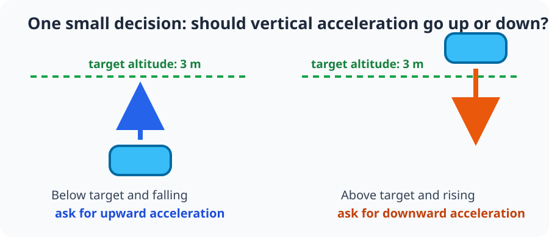
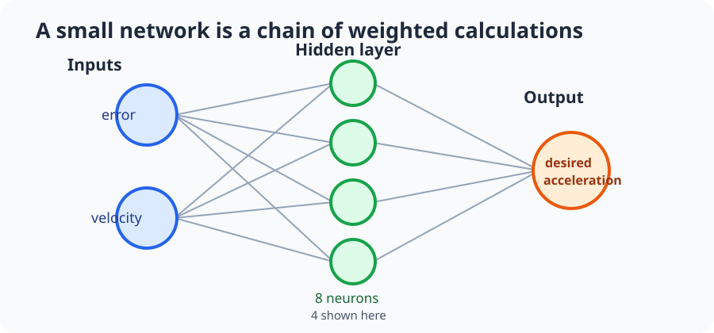
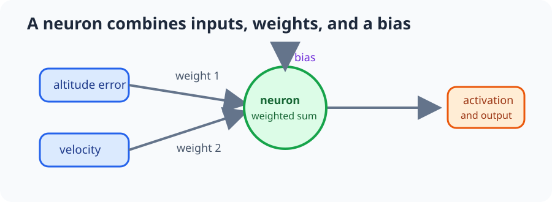
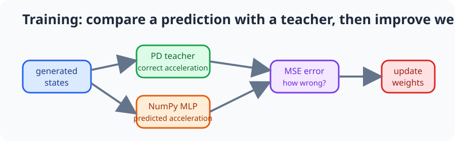
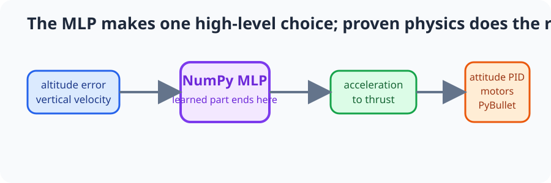
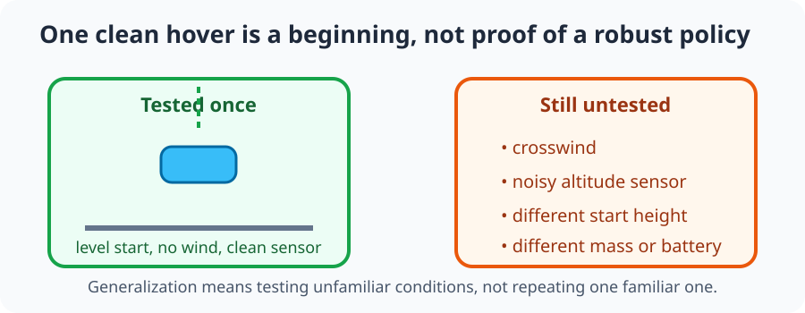

# Lesson 2: A tiny MLP learns one drone decision

This planned lesson is a gentle first step into machine learning for flight.
We will not ask a network to fly every motor. First, it learns one small
question: **should the drone accelerate up or down?**

## By the end, you will be able to

- Name the two measurements a small hover MLP reads.
- Explain, in plain language, what weights, a bias, and training data do.
- Describe how a learned vertical-acceleration command reaches the drone.
- Tell why one successful hover is not proof that a learned controller is safe.

---

## Start with a decision you already understand

Imagine the target altitude is 3 m. The drone is below it and is still moving
down. A sensible pilot asks for more upward acceleration.

The first MLP will see only two numbers:

- **Altitude error**: how far the drone is from its target height.
- **Vertical velocity**: whether it is moving up or down, and how fast.

It returns one number: the desired **vertical acceleration**. Positive means
"push upward more"; negative means "push upward less."

---

## What is an MLP?

An MLP (multi-layer perceptron) is a stack of tiny number calculators. Each
calculator mixes its inputs, then passes a result to the next layer. Our first
network is deliberately small: $2 \rightarrow 8 \rightarrow 1$.

- The **input layer** receives altitude error and vertical velocity.
- The **hidden layer** gives the network a few small calculators to combine
  those ideas.
- The **output layer** produces the acceleration request.

There is no magic inside a neuron. It multiplies incoming numbers by adjustable
**weights**, adds them, then shifts the result with a **bias**. Think of a
weight as a volume knob: training learns how strongly each input should matter.

---

## Learn safely before opening PyBullet

Before the drone simulation is involved, we can generate many pretend states:
"below the target and falling," "above it and climbing," and everything between.
A simple, visible PD rule supplies the answer that a careful pilot would choose:

$$
a_{teacher}=\operatorname{clip}(K_p\,error-K_d\,v_z,\,-a_{max},\,a_{max}).
$$

The MLP makes a guess, compares it with that teacher answer, and adjusts its
weights a tiny amount. Repeating that loop is training. No real drone needs to
fall while the network is learning this first lesson.

Optional reading: [Building a Multi-Layer Perceptron from Scratch with NumPy](https://elcaiseri.medium.com/building-a-multi-layer-perceptron-from-scratch-with-numpy-e4cee82ab06d).
That article teaches a classifier; this course adapts the core idea to predict
one continuous acceleration value instead.

---

## The MLP is not responsible for every motor

The learned output is only a high-level request. The existing deterministic
controllers and physics model still do the safety-critical low-level work.

Later lessons convert the requested acceleration into collective thrust, then
use the attitude PID and motor mixer to keep the drone level. PyBullet applies
gravity, motor forces, and contacts. This boundary makes the first learning
problem small enough to understand.

---

## A friendly warning: success can be memorization

If a network starts at the same height every time and hovers there once, it may
only have learned that one familiar situation. It has not yet proved that it can
handle a different start, sensor noise, wind, or a moving target.

The first goal is understanding, not a production autopilot. Later extensions
can test randomized starts, disturbances, and more realistic sensors.

---

## Try your pilot intuition

For each state, predict whether the MLP should request positive, near-zero, or
negative vertical acceleration.

| Drone state | Sensible request |
| --- | --- |
| Below the target and falling | Positive: accelerate upward |
| Near the target and almost still | Near zero: keep the current balance |
| Above the target and rising | Negative: reduce upward push |

This is the pattern later generated training data will teach. After the
standalone NumPy exercise, we will train a $2 \rightarrow 8 \rightarrow 1$
network on these examples before it controls a PyBullet hover.

---

## Review quiz

<form class="quiz" data-answer="b" data-explanation="The network reads height error and vertical velocity, then decides how vertical motion should change.">
  <fieldset>
    <legend>1. Which two measurements does the first hover MLP read?</legend>
    <label><input type="radio" name="mlp-intro-q1" value="a"> Camera colour and motor temperature</label> 
    <label><input type="radio" name="mlp-intro-q1" value="b"> Altitude error and vertical velocity</label> 
    <label><input type="radio" name="mlp-intro-q1" value="c"> GPS latitude and yaw angle</label>
  </fieldset>
  <button type="button" class="quiz-check">Check answer</button>
  

</form>

<form class="quiz" data-answer="c" data-explanation="The MLP supplies one high-level desired vertical acceleration; the deterministic controller and mixer still handle motors.">
  <fieldset>
    <legend>2. What does this first MLP produce?</legend>
    <label><input type="radio" name="mlp-intro-q2" value="a"> Four motor PWM values directly</label> 
    <label><input type="radio" name="mlp-intro-q2" value="b"> A camera bounding box</label> 
    <label><input type="radio" name="mlp-intro-q2" value="c"> A desired vertical acceleration</label>
  </fieldset>
  <button type="button" class="quiz-check">Check answer</button>
  

</form>

<form class="quiz" data-answer="a" data-explanation="Generated examples let us inspect whether the network is learning the intended rule before it is connected to the simulator.">
  <fieldset>
    <legend>3. Why generate training states before using PyBullet?</legend>
    <label><input type="radio" name="mlp-intro-q3" value="a"> We can check the learning idea safely with many labelled examples.</label> 
    <label><input type="radio" name="mlp-intro-q3" value="b"> PyBullet cannot simulate vertical motion.</label> 
    <label><input type="radio" name="mlp-intro-q3" value="c"> An MLP can only read generated data.</label>
  </fieldset>
  <button type="button" class="quiz-check">Check answer</button>
  

</form>

<form class="quiz" data-answer="b" data-explanation="A fixed, clean run can be memorized. Generalization needs different starts and disturbances.">
  <fieldset>
    <legend>4. A network hovers once from one clean starting state. What can we conclude?</legend>
    <label><input type="radio" name="mlp-intro-q4" value="a"> It is ready for every flight condition.</label> 
    <label><input type="radio" name="mlp-intro-q4" value="b"> It may have memorized that situation; more varied tests are needed.</label> 
    <label><input type="radio" name="mlp-intro-q4" value="c"> The attitude controller is no longer needed.</label>
  </fieldset>
  <button type="button" class="quiz-check">Check answer</button>
  

</form>

---

Previous: [Lesson 1: Build an MLP from scratch with NumPy](../01-numpy-mlp-basics/index.md).
The implementation roadmap is recorded in `design/mlp_vertical_hover_module_plan.md`.
