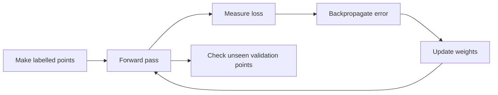
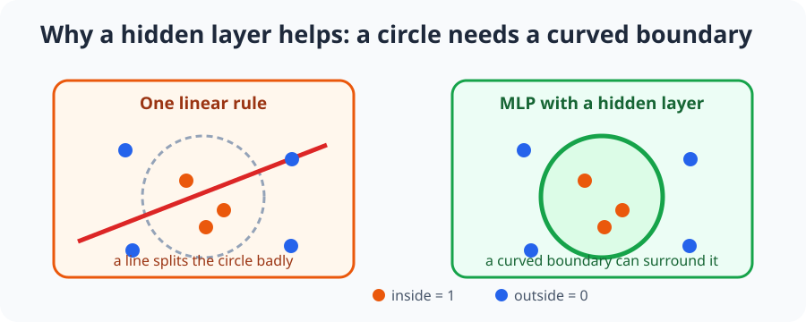
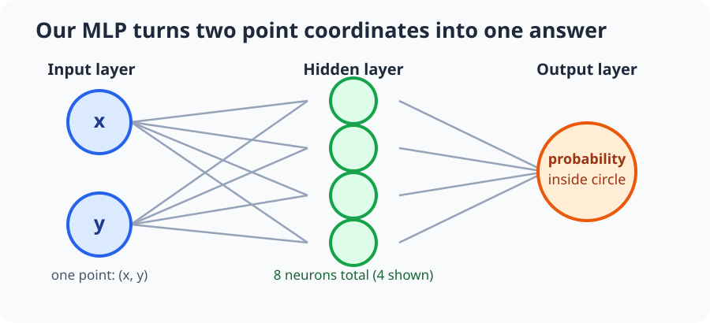
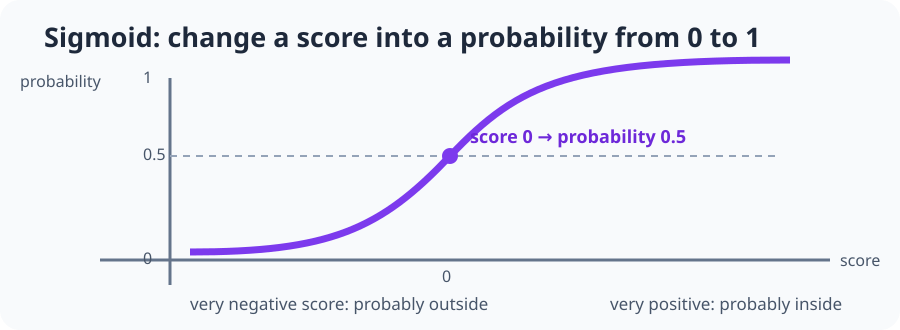

# Lesson 1: Build an MLP from scratch with NumPy

Before we use machine learning for a drone, we need to see why a neural network
is useful. This lesson builds one with only Python, NumPy, and Matplotlib—no
PyBullet and no machine-learning framework.

## By the end, you will be able to

- Explain why one straight decision line cannot separate points inside a circle.
- Build a $2 \rightarrow 8 \rightarrow 1$ MLP with NumPy arrays.
- Train its weights using a loss value and manual backpropagation.
- Validate the trained model on points it has not seen before.



---

## NumPy essentials: a table of numbers

NumPy gives Python an **array**: a neat box of numbers that we can calculate
with all at once. We write `np` as a short name for NumPy:

```python
import numpy as np

one_point = np.array([0.2, -0.4])
points = np.array([
    [0.2, -0.4],
    [0.7, 0.1],
    [-0.3, 0.8],
], dtype=float)
```

`one_point` has shape `(2,)`: it is one row-like list with two values. `points`
has shape `(3, 2)`: three rows, each containing an `x` and `y` coordinate.
Always read a shape from left to right: `(rows, columns)`.

```python
print(points.shape)                  # (3, 2)
print(points[0])                     # first point: [0.2, -0.4]
print(points[:, 0])                  # every x coordinate: [0.2, 0.7, -0.3]
print(np.sum(points**2, axis=1, keepdims=True))  # squared distance per row
```

The `** 2` squares every number. `axis=1` says "add across each row," and
`keepdims=True` keeps the answer as a one-column array with shape `(3, 1)`.
That is exactly how the script decides whether each point is inside the circle.

Use `np.zeros` when we need starting bias values, and a seeded random generator
when we need repeatable examples:

```python
bias = np.zeros((1, 8))
rng = np.random.default_rng(7)
random_points = rng.uniform(-1.0, 1.0, size=(3, 2))
```

Two symbols look similar but do different jobs. `*` multiplies matching cells;
`@` is matrix multiplication, which sends the values from one network layer to
the next. NumPy also **broadcasts** a `(1, 8)` bias across every row in an
`(N, 8)` hidden layer, so every neuron receives its own bias for every point.

---

## Quick check: NumPy arrays

<form class="quiz" data-answer="c" data-explanation="The @ operator performs matrix multiplication, which combines each point's two input values with the weights for hidden neurons.">
  <fieldset>
    <legend>Which NumPy operator sends values from one MLP layer to the next?</legend>
    <label><input type="radio" name="numpy-mlp-q1" value="a"> `+`</label><br>
    <label><input type="radio" name="numpy-mlp-q1" value="b"> `*`</label><br>
    <label><input type="radio" name="numpy-mlp-q1" value="c"> `@`</label>
  </fieldset>
  <button type="button" class="quiz-check">Check answer</button>
  <p class="quiz-result" aria-live="polite"></p>
</form>

---

## The problem: inside or outside?

Our input is a point with two numbers: $x$ and $y$. The answer is `1` if the
point is inside a circle of radius `0.55`, otherwise it is `0`.



A simple linear model can only draw one straight boundary. A circle needs a
curved boundary, so it gives the hidden layer a real job to do. The MLP does
not know what a circle is at the beginning. It starts with random numbers and
slowly improves them after seeing examples.

---

## Meet the three layers

Think of a layer as a row of small calculators. A calculator takes numbers in,
does some arithmetic, and passes one number on. The network has three rows:



1. **Input layer:** receives the point's `x` and `y` coordinates. It does not
   learn anything; it just holds the two numbers.
2. **Hidden layer:** has eight calculators. Each learns a different useful
   pattern from `x` and `y`. Several simple patterns together can make a curved
   boundary.
3. **Output layer:** combines the eight hidden answers into one probability:
   "how likely is this point to be inside?"

---

## Quick check: why an MLP?

<form class="quiz" data-answer="b" data-explanation="A line divides the plane into two halves, but it cannot make a closed loop around the inside of a circle.">
  <fieldset>
    <legend>Why is a circle a useful first MLP problem?</legend>
    <label><input type="radio" name="numpy-mlp-q2" value="a"> NumPy cannot store a circle.</label><br>
    <label><input type="radio" name="numpy-mlp-q2" value="b"> One straight boundary cannot surround a circle.</label><br>
    <label><input type="radio" name="numpy-mlp-q2" value="c"> Circles always need camera images.</label>
  </fieldset>
  <button type="button" class="quiz-check">Check answer</button>
  <p class="quiz-result" aria-live="polite"></p>
</form>

---

## Step 1: make labelled examples

The script creates 800 random points for training and 400 new points for
validation. A **label** is simply the answer we already know: `1` inside the
circle and `0` outside.

Training data is allowed to change the weights. Validation data is not—it checks
whether the network learned the rule instead of only remembering its training
points. It is like practising with one worksheet and taking a different quiz.

The important shapes are:

| Value | Shape | Meaning |
| --- | --- | --- |
| `points` | `(N, 2)` | `N` points, each with `x` and `y` |
| `labels` | `(N, 1)` | One inside/outside answer per point |
| hidden output | `(N, 8)` | Eight small calculations per point |
| probability | `(N, 1)` | A guess between 0 and 1 |

---

## Step 2: give the network adjustable numbers

Every connection between two layers has a **weight**. A weight is a volume knob:
a large positive value makes an input matter more, while a negative value makes
it push the result in the opposite direction. Every neuron also has a **bias**,
which is its small starting offset.

```python
parameters = {
    "w1": rng.normal(0.0, 0.7, size=(2, 8)),  # input → hidden weights
    "b1": np.zeros((1, 8)),                   # one bias per hidden neuron
    "w2": rng.normal(0.0, 0.7, size=(8, 1)),  # hidden → output weights
    "b2": np.zeros((1, 1)),                   # output bias
}
```

The random weights are not clever guesses. They merely make each hidden neuron
start differently. Training will decide better values.

---

## Quick check: weights and biases

<form class="quiz" data-answer="a" data-explanation="The bias has one value for each of the eight hidden neurons. NumPy broadcasts that one row across all training points.">
  <fieldset>
    <legend>Why is the first bias array shaped `(1, 8)`?</legend>
    <label><input type="radio" name="numpy-mlp-q3" value="a"> It gives each of eight hidden neurons one bias value.</label><br>
    <label><input type="radio" name="numpy-mlp-q3" value="b"> It stores eight training points with one coordinate.</label><br>
    <label><input type="radio" name="numpy-mlp-q3" value="c"> It is the final inside/outside answer.</label>
  </fieldset>
  <button type="button" class="quiz-check">Check answer</button>
  <p class="quiz-result" aria-live="polite"></p>
</form>

---

## Step 3: make a forward pass

The MLP has two input values, eight hidden neurons, and one output probability.
In NumPy, `@` means matrix multiplication. It lets every point visit every
neuron at once:

$$
hidden=\tanh(points\,W_1+b_1)
$$

$$
probability=\operatorname{sigmoid}(hidden\,W_2+b_2)
$$

The first line gives each hidden neuron a score. The second line turns the
combined hidden score into a probability.

```python
hidden_input = points @ parameters["w1"] + parameters["b1"]
hidden_output = np.tanh(hidden_input)
output_input = hidden_output @ parameters["w2"] + parameters["b2"]
probabilities = sigmoid(output_input)
```

---

## Step 4: why use `tanh` and sigmoid?

Without activation functions, stacking layers would still act like one large
straight-line calculation. Activations add bends, which lets the network make a
curved answer.

- `tanh` changes a hidden score to a number between `-1` and `1`. It gives the
  hidden layer a useful bend without needing students to tune it by hand.
- **Sigmoid** changes the final score to a number between `0` and `1`, which is
  perfect for an inside/outside probability.

```python
def sigmoid(values):
    return 1.0 / (1.0 + np.exp(-np.clip(values, -50.0, 50.0)))
```



At the end, the script uses a simple rule: probability `>= 0.5` means "inside";
otherwise it means "outside." A probability is more useful than a plain yes/no
because it also shows how confident the network is.

---

## Quick check: activation functions

<form class="quiz" data-answer="c" data-explanation="Sigmoid changes the final score into a number between zero and one, so it can be used as an inside-circle probability.">
  <fieldset>
    <legend>What does sigmoid give the output layer in this lesson?</legend>
    <label><input type="radio" name="numpy-mlp-q4" value="a"> A second x coordinate.</label><br>
    <label><input type="radio" name="numpy-mlp-q4" value="b"> Eight new hidden neurons.</label><br>
    <label><input type="radio" name="numpy-mlp-q4" value="c"> A probability from 0 to 1.</label>
  </fieldset>
  <button type="button" class="quiz-check">Check answer</button>
  <p class="quiz-result" aria-live="polite"></p>
</form>

---

## Step 5: measure the mistake

The prediction is compared with the correct label using **binary cross-entropy
loss**. You can read it as a score for probability mistakes: confidently saying
`0.99` when the correct answer is `0` is a much bigger mistake than saying
`0.55`.

Smaller loss is better. Accuracy is different: it only counts whether the final
answer falls on the correct side of `0.5`. We print both because they tell us
different things.

---

## Step 6: correct the weights, then validate

**Backpropagation** answers: "which weights helped cause this mistake, and by
how much?" The `backward` function sends the error from the output layer back
through the hidden layer and calculates a **gradient** for every weight and bias.

**Gradient descent** then makes one small correction:

```python
parameters[name] -= LEARNING_RATE * gradient
```

That one line means: move each adjustable number a little in the direction that
reduces loss. Repeat forward pass → loss → backward pass → update thousands of
times. The validation points never take part in `backward` or `update`; they are
only checked to see if the learned rule works on new points.

---

## Quick check: training and validation

<form class="quiz" data-answer="b" data-explanation="Validation points stay out of weight updates. They are a fair check of whether the network can handle new points.">
  <fieldset>
    <legend>Why are validation points never used in `backward` or `update`?</legend>
    <label><input type="radio" name="numpy-mlp-q5" value="a"> They would make NumPy stop working.</label><br>
    <label><input type="radio" name="numpy-mlp-q5" value="b"> They should stay unseen so they test the learned rule fairly.</label><br>
    <label><input type="radio" name="numpy-mlp-q5" value="c"> They do not have x and y coordinates.</label>
  </fieldset>
  <button type="button" class="quiz-check">Check answer</button>
  <p class="quiz-result" aria-live="polite"></p>
</form>

---

## Run the complete implementation

```bash
uv run python examples/09-mlp-hover/mlp_circle_from_scratch.py
```

The program prints training and validation loss every 250 epochs, requires at
least 95% validation accuracy, and saves a plot at
`outputs/mlp_circle_classifier.png`. The left plot shows the learned boundary
on unseen points; the right plot shows training and validation loss.

Read the source from top to bottom. The function names match the lesson steps:
`make_dataset` creates examples, `initialize_parameters` creates the adjustable
numbers, `forward` makes a prediction, `backward` calculates corrections,
`train` repeats the learning loop, and `plot_results` makes the evidence easy
to inspect.

```python
--8<-- "examples/09-mlp-hover/mlp_circle_from_scratch.py"
```

---

## Hands-on: change one thing

Open the script and try one change at a time:

1. In a Python shell, declare three points with `np.array`, print their shape,
   and calculate `np.sum(points**2, axis=1, keepdims=True)`.
2. Set `HIDDEN_NEURONS = 1`, run it, and compare the boundary and validation accuracy.
3. Set `RADIUS = 0.75`, then observe that the same learning process learns a larger circle.
4. Set `EPOCHS = 250`, then compare its loss and validation accuracy with the default run.

Do not change the validation data while comparing runs. It is the fair test.

---

Next: [Lesson 2: A tiny MLP learns one drone decision](../01-mlp-introduction/index.md).
