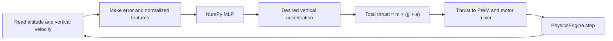
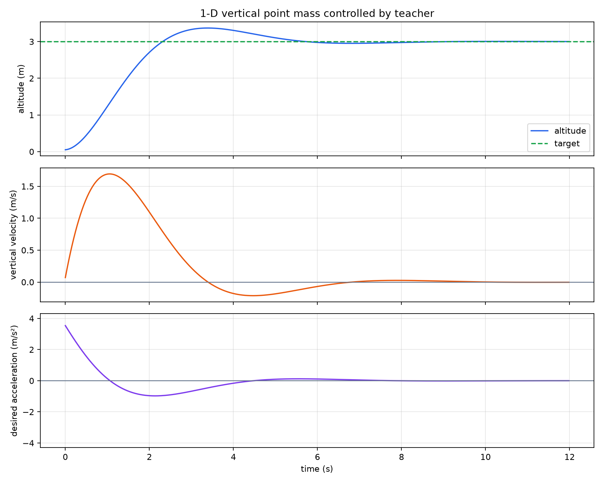
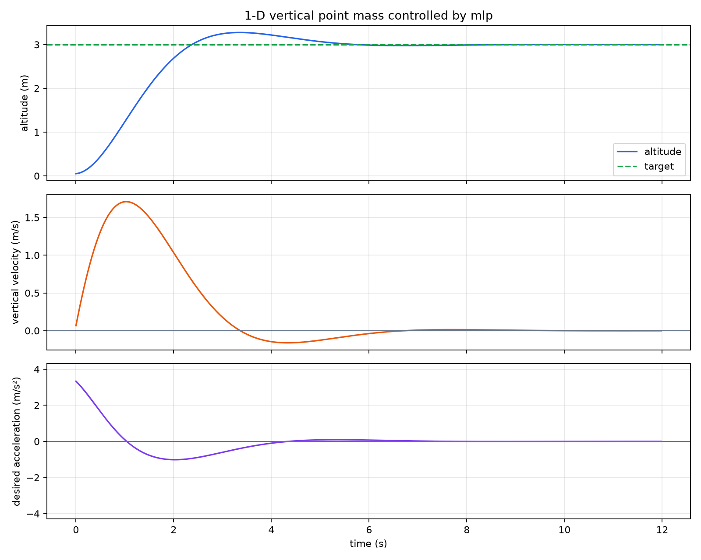
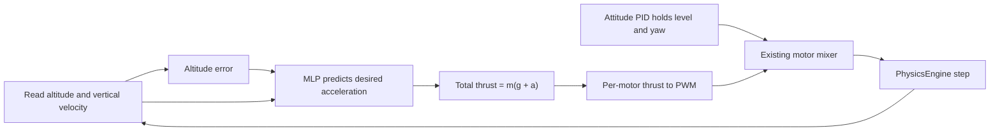

# Lesson 3: From an MLP to vertical acceleration

This guide turns the NumPy MLP idea into a safe flight-control plan. We will
first teach the network a simple rule away from PyBullet, prove that it learned
the rule, and only then connect it to the drone simulator.

## By the end, you will be able to

- State the exact inputs, output, and units for the first learned controller.
- Explain why generated teacher data comes before a PyBullet hover.
- Convert a desired vertical acceleration into collective motor thrust.
- Follow the checks that must pass before a learned model controls the drone.



---

## The one job we give the MLP

The first learned controller has a deliberately small job. It does not choose
four motor PWM values and it does not try to keep the drone level.

| Item | Value | Unit |
| --- | --- | --- |
| Input 1 | altitude error: `target_altitude - altitude` | m |
| Input 2 | vertical velocity `vz` | m/s |
| MLP output | desired vertical acceleration `a_desired` | m/s² |
| Existing code still owns | roll, pitch, yaw, motor mixing, motor delay, physics | — |

For example, when the drone is below 3 m and falling, the output should be a
positive acceleration. When it is above 3 m and still rising, the output should
be negative, so total upward thrust is reduced.

---

## Quick check: choose the output

<form class="quiz" data-answer="b" data-explanation="The MLP makes one high-level acceleration request. Existing deterministic code still turns that request into individual motor commands.">
  <fieldset>
    <legend>What should the first learned controller output?</legend>
    <label><input type="radio" name="vertical-practice-q1" value="a"> Four motor PWM values.</label><br>
    <label><input type="radio" name="vertical-practice-q1" value="b"> Desired vertical acceleration in m/s².</label><br>
    <label><input type="radio" name="vertical-practice-q1" value="c"> A desired yaw angle.</label>
  </fieldset>
  <button type="button" class="quiz-check">Check answer</button>
  <p class="quiz-result" aria-live="polite"></p>
</form>

---

## Start with generated teacher data

Start by generating data. Do **not** begin by letting an untrained network fly
in PyBullet. A generated teacher gives the correct answer for many situations,
is repeatable, and makes it easy to find a training mistake.

Our transparent teacher is a small PD rule:

$$
a_{teacher}=\operatorname{clip}(1.2\,e-1.2\,v_z,\,-4.0,\,4.0).
$$

Here, $e$ is altitude error in metres and $v_z$ is vertical velocity in m/s.
The answer is limited to $-4.0$ through $+4.0$ m/s² so the first network never
learns an unrealistic acceleration request.

Generate examples that cover the whole first hover problem:

- altitude error from `-3.0` to `+3.0` m;
- vertical velocity from `-3.0` to `+3.0` m/s;
- a deterministic grid for training, plus a separately seeded random set for
  validation.

This small command is runnable by itself and lets you inspect teacher labels
before any MLP exists:

```bash
uv run python - <<'PY'
import numpy as np

def teacher_acceleration(error_m, vertical_velocity_mps):
    return np.clip(1.2 * error_m - 1.2 * vertical_velocity_mps, -4.0, 4.0)

states = np.array([[2.0, -1.0], [0.0, 0.0], [-1.0, 0.5]])
for error_m, velocity_mps in states:
    print(error_m, velocity_mps, teacher_acceleration(error_m, velocity_mps))
PY
```

Expected behaviour: the first state requests upward acceleration, the second
requests zero, and the third requests downward acceleration.

---

## Quick check: why generate data first?

<form class="quiz" data-answer="a" data-explanation="The PD teacher provides correct, repeatable labels across falling, hovering, and climbing states before any model is allowed into closed-loop flight.">
  <fieldset>
    <legend>Why should generated teacher data come before PyBullet training runs?</legend>
    <label><input type="radio" name="vertical-practice-q2" value="a"> It gives safe, repeatable labels for many flight states.</label><br>
    <label><input type="radio" name="vertical-practice-q2" value="b"> PyBullet cannot read altitude.</label><br>
    <label><input type="radio" name="vertical-practice-q2" value="c"> An MLP cannot use simulation data.</label>
  </fieldset>
  <button type="button" class="quiz-check">Check answer</button>
  <p class="quiz-result" aria-live="polite"></p>
</form>

---

## See the teacher and MLP in action: a 1-D point mass

Before using PyBullet, run the smallest possible motion model. It has altitude
and vertical velocity, but no motors, drag, or attitude. The PD teacher output
is treated as the **net** vertical acceleration, so the code can show the
control idea directly:

```bash
uv run python examples/09-mlp-hover/vertical_acceleration_point_mass.py
```

It saves `outputs/vertical_acceleration_point_mass.png` with three traces:

1. **Altitude:** the point mass rises toward 3 m and may overshoot.
2. **Vertical velocity:** positive values mean climbing; negative values mean
   descending back toward the target.
3. **Desired acceleration:** positive commands start the climb, while negative
   commands brake the climb before and after the target.

### What you should see



The first run rises quickly, overshoots the target, then settles. Read the three
plots from top to bottom: positive acceleration starts the climb, negative
acceleration slows it down, and the velocity plot shows the change of direction.

To watch the dot move while the telemetry lines grow, use:

```bash
uv run python examples/09-mlp-hover/vertical_acceleration_point_mass.py --animate
```

Close the animation window to stop the replay. The default command only saves
the PNG and exits, so it is suitable for terminals without a display.

The point-mass simulator accepts a controller function:

```python
telemetry = simulate(teacher_acceleration_command, seconds=12.0)
```

The trained MLP uses the same two inputs and acceleration output. Train it, then
run the same simulation with `--controller mlp`:

```bash
uv run python examples/09-mlp-hover/vertical_acceleration_mlp.py
uv run python examples/09-mlp-hover/vertical_acceleration_point_mass.py --controller mlp
```



The retuned MLP snapshot reaches 3.00 m, peaks at 3.28 m, and finishes with nearly zero
vertical velocity. It follows the PD teacher closely, but it is a learned
approximation—not the original formula. The simulator, plots, and validation
measurements stay the same for both controllers.

---

## Train offline before flight

The MLP from Lesson 1 becomes a regression network: it predicts a number, not
an inside/outside probability. Keep the network small: $2 \rightarrow 8 \rightarrow 1$.

| Part | First implementation choice |
| --- | --- |
| Inputs | `error_m / 3.0`, `vertical_velocity_mps / 3.0` |
| Hidden layer | eight `tanh` neurons |
| Output layer | one **linear** value, no sigmoid |
| Training target | `a_teacher / 4.0` |
| Loss | mean squared error (MSE) |
| Prediction | multiply the output by `4.0` to recover m/s² |

Normalization keeps the values near `-1` to `+1`, where `tanh` learns more
comfortably. It does not change the physics; it only gives the network easier
numbers to work with.

Use a separately seeded random validation set. The trainer reports mean absolute
acceleration error (MAE) on those unseen states. The offline gate is
**MAE ≤ 0.15 m/s²** before connecting to PyBullet; the deterministic first run
passes at **0.125 m/s²**.

---

## Quick check: normalize without changing units

<form class="quiz" data-answer="c" data-explanation="The MLP sees normalized values while training, then its output is multiplied by 4.0 to return to physical acceleration in m/s².">
  <fieldset>
    <legend>Why divide the training inputs by 3.0 and the target by 4.0?</legend>
    <label><input type="radio" name="vertical-practice-q3" value="a"> To remove the drone mass from the physics.</label><br>
    <label><input type="radio" name="vertical-practice-q3" value="b"> To convert acceleration directly to PWM.</label><br>
    <label><input type="radio" name="vertical-practice-q3" value="c"> To give the MLP small, easy-to-learn values before converting back.</label>
  </fieldset>
  <button type="button" class="quiz-check">Check answer</button>
  <p class="quiz-result" aria-live="polite"></p>
</form>

---

## Convert acceleration to thrust

After the MLP has passed offline validation, its prediction becomes physical
force:

$$
T_{total}=m\,(g+a_{desired}).
$$

For this course drone, mass is `0.65 kg` and gravity is `9.81 m/s²`. At
`a_desired = 0`, the drone needs hover thrust $mg$. A positive acceleration adds
thrust; a negative acceleration removes some thrust.

Then the existing code does the rest:

```text
total thrust (N)
  → divide equally between four motors
  → clamp each motor thrust to its physical limits
  → PhysicsEngine.pwm_from_thrust(...)
  → existing attitude PID and motor mixer
  → PhysicsEngine.step(...)
```

Important: Module 6's existing altitude PID output is already a **force
correction in N** because it is added to `mass * 9.81`. Do not use that number
as an acceleration label without dividing by mass. The planned teacher avoids
this confusion by directly producing acceleration in m/s².

---

## Quick check: acceleration becomes thrust

<form class="quiz" data-answer="b" data-explanation="The learned acceleration is converted to total force with m(g + a), then the existing engine converts that force into motor PWM.">
  <fieldset>
    <legend>After the MLP predicts `a_desired`, what is the next physical calculation?</legend>
    <label><input type="radio" name="vertical-practice-q4" value="a"> Send acceleration directly to all motor PWM inputs.</label><br>
    <label><input type="radio" name="vertical-practice-q4" value="b"> Calculate total thrust as `mass * (9.81 + a_desired)`.</label><br>
    <label><input type="radio" name="vertical-practice-q4" value="c"> Replace the attitude PID with the MLP.</label>
  </fieldset>
  <button type="button" class="quiz-check">Check answer</button>
  <p class="quiz-result" aria-live="polite"></p>
</form>

---

## Use PyBullet as the final closed-loop test

Only after the offline model passes should it drive one simple PyBullet case:

| Setting | First test value |
| --- | --- |
| Start altitude | `0.05 m` |
| Target altitude | `3.0 m` |
| Start velocity | `0 m/s` |
| Wind and sensor noise | off |
| Horizontal target | level, no movement |

The model passes this first test only if it reaches 3 m, stays within `±0.15 m`
for three seconds, and never exceeds `3.5 m`. PyBullet is valuable here because
it includes motor delay, thrust limits, gravity, drag, and full rigid-body
motion—things the simple generated teacher does not include.

If this test fails, return to the offline plot and inspect the teacher labels,
normalization, output denormalization, and force units before changing the MLP.

---

## Run the learned MLP in PyBullet

Now the MLP can control the real course drone model. It still makes only one
high-level request: a desired vertical acceleration. The shared physics code
does the safety-critical lower-level work.



First train the model. The weight file is kept in `outputs/`, so each student
can reproduce it instead of relying on a committed model file:

```bash
uv run python examples/09-mlp-hover/vertical_acceleration_mlp.py
```

Then run the learned policy headlessly. It writes a four-panel plot for
altitude, vertical velocity, requested acceleration, and actual total thrust:

```bash
uv run python examples/09-mlp-hover/mlp_pybullet_hover.py --headless
```

To watch the same flight in the PyBullet GUI, omit `--headless`. The overlay
shows the MLP acceleration request, target altitude, motor PWM, rotor thrust,
and the measured drone state. Green arrows show the rotor forces.

Use the PD teacher as a baseline with the same physics and plotting code:

```bash
uv run python examples/09-mlp-hover/mlp_pybullet_hover.py --controller teacher --headless --output outputs/teacher_pybullet_hover.png
```


The deterministic learned flight peaks at **3.19 m**, settles at **3.00 m**,
and ends with zero vertical velocity. The script asserts the first-flight
contract: stay below 3.5 m, remain within ±0.15 m of target for the final three
seconds, and finish with near-zero vertical speed.

### Hands-on: compare the learned policy

Run both commands, then compare the saved PNGs. Does the MLP make the same
general climb-and-brake shape as the teacher? Change `--target-altitude` to
`2.0`, rerun both, and explain why the MLP can still work: it sees altitude
**error**, not a hard-coded target altitude.

---

## Quick check: who owns the motors?

<form class="quiz" data-answer="c" data-explanation="The MLP requests acceleration. Shared deterministic code converts force to PWM, mixes motors, and holds the drone attitude.">
  <fieldset>
    <legend>Which part turns the MLP output into individual motor commands?</legend>
    <label><input type="radio" name="vertical-practice-q6" value="a"> The MLP directly writes four PWM values.</label><br>
    <label><input type="radio" name="vertical-practice-q6" value="b"> The altitude sensor chooses motor thrust.</label><br>
    <label><input type="radio" name="vertical-practice-q6" value="c"> The existing force-to-PWM converter, mixer, and attitude PID.</label>
  </fieldset>
  <button type="button" class="quiz-check">Check answer</button>
  <p class="quiz-result" aria-live="polite"></p>
</form>

---

## Quick check: PyBullet comes last

<form class="quiz" data-answer="a" data-explanation="PyBullet is the final closed-loop check: it reveals whether a model that matched the teacher still works with motor delay and physical limits.">
  <fieldset>
    <legend>What is PyBullet's first role in this learning path?</legend>
    <label><input type="radio" name="vertical-practice-q5" value="a"> Test a validated MLP in a closed-loop hover.</label><br>
    <label><input type="radio" name="vertical-practice-q5" value="b"> Replace the generated teacher labels.</label><br>
    <label><input type="radio" name="vertical-practice-q5" value="c"> Choose the MLP's random starting weights.</label>
  </fieldset>
  <button type="button" class="quiz-check">Check answer</button>
  <p class="quiz-result" aria-live="polite"></p>
</form>

---

## Hands-on planning exercise

Before writing the trainer, make a three-row table for these states: below and
falling, on target and still, above and rising. Write the expected sign of
`a_teacher` and whether total thrust should be above, equal to, or below hover
thrust. Then change one teacher gain and predict which rows change most.

Next: test whether this simple learned policy still works when its start height,
wind, sensor readings, or target altitude change.
