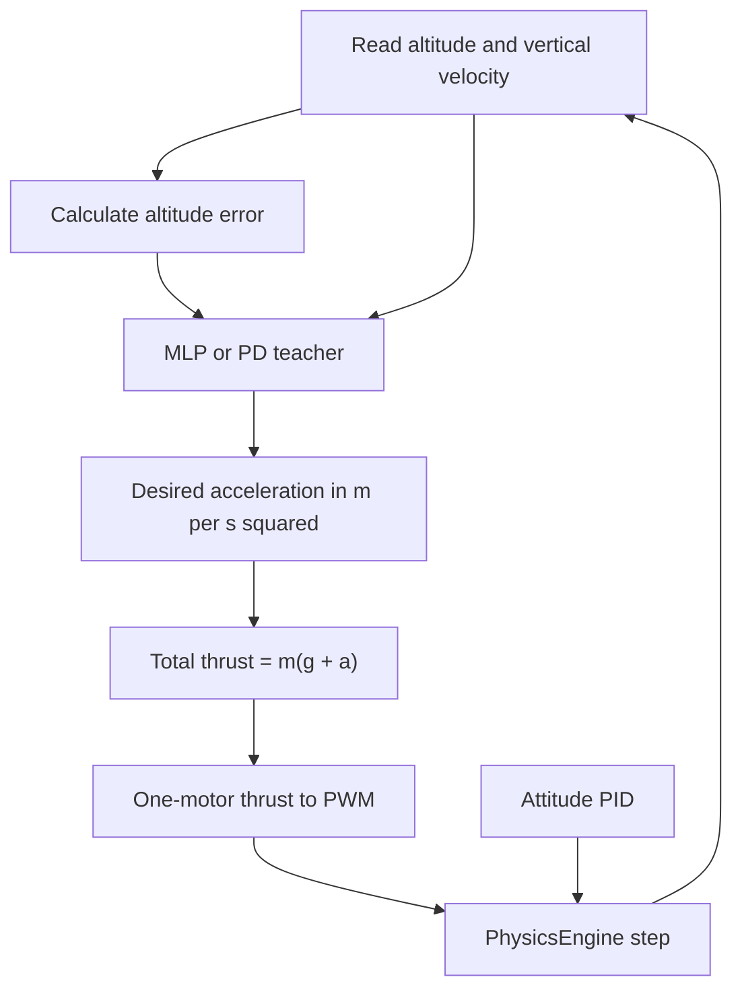
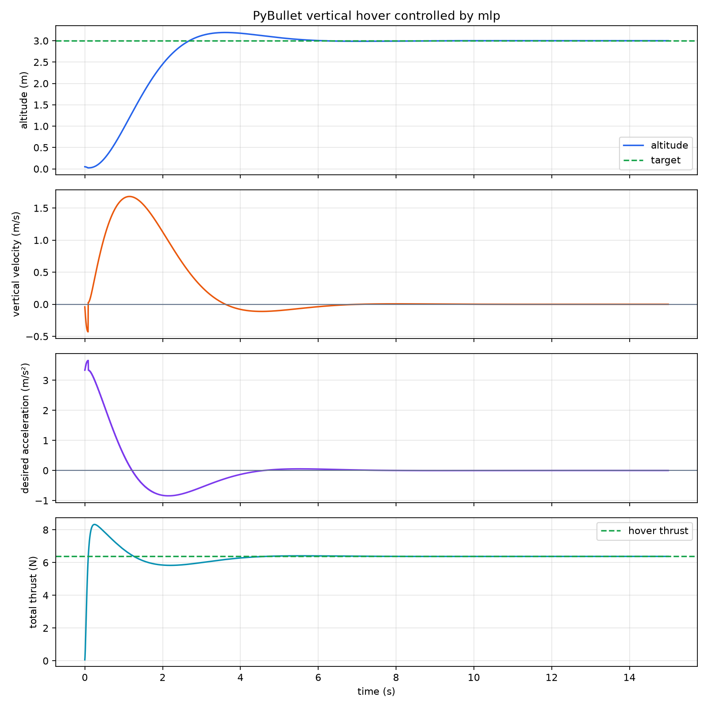

# Lesson 4: Read the PyBullet MLP hover code

This lesson walks through `examples/09-mlp-hover/mlp_pybullet_hover.py`. The MLP has one job: choose a desired vertical acceleration. Existing code still stabilizes attitude, drives motors, and advances PyBullet.

## By the end, you will be able to

- Follow altitude and velocity into a motor PWM command.
- Convert a desired acceleration in m/s² into force in N.
- Explain why the controller updates at 120 Hz while physics updates at 240 Hz.
- Compare the learned MLP with its PD teacher.



---

## Run the complete example

First create the saved MLP weights, then run the closed loop in PyBullet:

```bash
uv run python examples/09-mlp-hover/vertical_acceleration_mlp.py
uv run python examples/09-mlp-hover/mlp_pybullet_hover.py --headless
```

The trainer writes `outputs/vertical_acceleration_mlp.npz`. The hover script loads it and saves `outputs/mlp_pybullet_hover.png`.

To compare the visible PD teacher through the same motor and physics path:

```bash
uv run python examples/09-mlp-hover/mlp_pybullet_hover.py --controller teacher --headless --output outputs/teacher_pybullet_hover.png
```

---

## 1. The controller contract

```python
def make_controller(name, model_path):
    if name == "teacher":
        return lambda error_m, vz_mps: float(teacher_acceleration(error_m, vz_mps))
    return VerticalAccelerationMlp.load(model_path).predict_acceleration
```

Both choices have the same inputs and output:

| Value | Meaning | Unit |
| --- | --- | --- |
| `error_m` | target altitude minus measured altitude | m |
| `vz_mps` | measured vertical velocity | m/s |
| return value | desired net vertical acceleration | m/s² |

This lets us swap the teacher for the MLP without rewriting any PyBullet or motor code.

### Quiz: does the MLP choose PWM?

<form class="quiz" data-answer="b" data-explanation="The MLP asks for one desired vertical acceleration. Shared deterministic code owns motor PWM.">
  <fieldset>
    <legend>What does `predict_acceleration(error_m, vz_mps)` return?</legend>
    <label><input type="radio" name="mlp-code-q1" value="a"> Four motor PWM values.</label><br>
    <label><input type="radio" name="mlp-code-q1" value="b"> One desired vertical acceleration in m/s².</label><br>
    <label><input type="radio" name="mlp-code-q1" value="c"> A new drone position.</label>
  </fieldset>
  <button type="button" class="quiz-check">Check answer</button>
  <p class="quiz-result" aria-live="polite"></p>
</form>

---

## 2. Read the state at the controller rate

The physics engine advances at 240 Hz. The high-level controller updates at 120 Hz, so it makes a new decision every two physics steps:

```python
if step % SETTINGS.control_steps == 0:
    state = read_state(drone)
    error_m = target_altitude_m - state.position_m[2]
    desired_acceleration_mps2 = controller(
        error_m, state.linear_velocity_mps[2]
    )
```

Between updates, the most recent acceleration, PWM, and torque command stay in use while the motor model and PyBullet keep moving the drone.

### Quiz: what happens between updates?

<form class="quiz" data-answer="c" data-explanation="PyBullet advances two 240 Hz steps using the most recent command; the MLP neither retrains nor pauses physics.">
  <fieldset>
    <legend>What happens after one 120 Hz control update?</legend>
    <label><input type="radio" name="mlp-code-q2" value="a"> The MLP retrains twice.</label><br>
    <label><input type="radio" name="mlp-code-q2" value="b"> The drone pauses until the next update.</label><br>
    <label><input type="radio" name="mlp-code-q2" value="c"> Physics advances using the newest commands.</label>
  </fieldset>
  <button type="button" class="quiz-check">Check answer</button>
  <p class="quiz-result" aria-live="polite"></p>
</form>

---

## 3. Convert acceleration to thrust and PWM

```python
total_thrust_n = MODEL.mass_kg * (9.81 + desired_acceleration_mps2)
pwm_us = engine.pwm_from_thrust(
    clamp(total_thrust_n / 4.0, 0.0, MODEL.max_thrust_per_motor_n)
)
```

At `0.0 m/s²`, the formula becomes $T=mg$: hover thrust. A positive request adds upward force; a negative request removes force. The total force is divided equally between four motors, clamped to their physical limit, then converted from newtons to PWM microseconds.

| Value | Hover value |
| --- | --- |
| Drone mass | `0.65 kg` |
| Total hover thrust | about `6.38 N` |
| One motor hover thrust | about `1.59 N` |

### Quiz: what does zero acceleration mean?

<form class="quiz" data-answer="a" data-explanation="Zero desired acceleration requests T = mg, enough upward force to balance gravity.">
  <fieldset>
    <legend>If the MLP returns `0.0 m/s²`, what total thrust is requested?</legend>
    <label><input type="radio" name="mlp-code-q3" value="a"> Hover thrust: mass times gravity.</label><br>
    <label><input type="radio" name="mlp-code-q3" value="b"> Zero thrust.</label><br>
    <label><input type="radio" name="mlp-code-q3" value="c"> Maximum thrust.</label>
  </fieldset>
  <button type="button" class="quiz-check">Check answer</button>
  <p class="quiz-result" aria-live="polite"></p>
</form>

---

## 4. Hold attitude, step physics, then verify

```python
torque_nm = attitude_controller.update(read_imu(drone), initial_yaw)
flight_step = engine.step(drone, pwm_us, torque_nm)
```

The attitude PID holds roll, pitch, and the initial yaw angle. `PhysicsEngine.step()` mixes that torque with collective thrust, moves motor RPM toward its target, applies forces and drag, then calls PyBullet’s simulation step. The next loop reads the new state.

At the end, `verify()` asserts three facts: peak altitude stays below 3.5 m, the final three seconds remain within ±0.15 m of target, and final vertical speed is near zero.



### Quiz: which rule catches a late drift?

<form class="quiz" data-answer="c" data-explanation="The final-three-seconds altitude rule catches a drone that reaches the target briefly but cannot hold it.">
  <fieldset>
    <legend>Which check detects a drone that reaches 3 m but drifts away afterwards?</legend>
    <label><input type="radio" name="mlp-code-q4" value="a"> The model-file check.</label><br>
    <label><input type="radio" name="mlp-code-q4" value="b"> The PWM conversion.</label><br>
    <label><input type="radio" name="mlp-code-q4" value="c"> The final-three-seconds ±0.15 m check.</label>
  </fieldset>
  <button type="button" class="quiz-check">Check answer</button>
  <p class="quiz-result" aria-live="polite"></p>
</form>

---

## Hands-on

1. Run the MLP and teacher modes. Compare their peak altitude and requested-acceleration traces.
2. Run `--target-altitude 2.0`. Explain why the same MLP can react: it sees altitude error, not a hard-coded target.
3. Change the trainer acceleration limit from `4.0` to `2.0`, retrain, and predict how the climb plot will change before you run it.

Next: test the policy from more starting heights and add one disturbance at a time.
