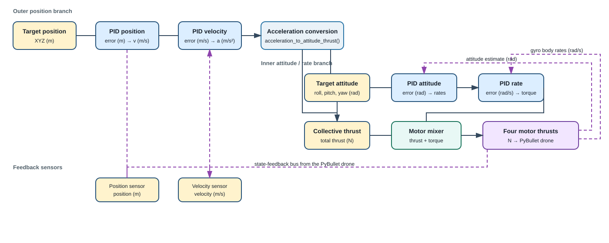
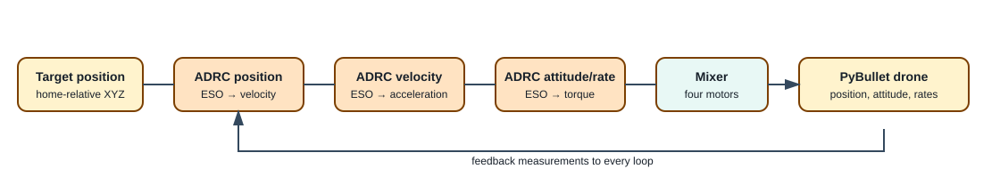
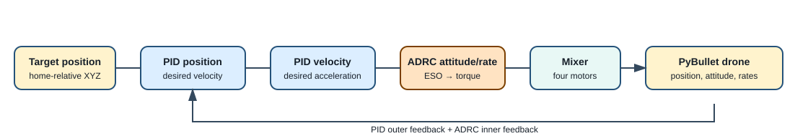
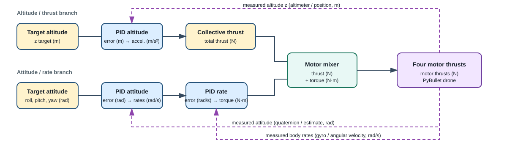
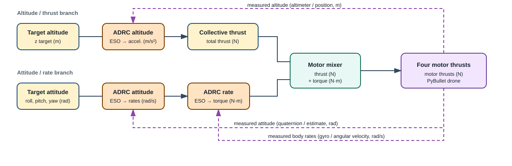

# Module 04: Motor Mixing and Control

These examples run the same PyBullet quadcopter with different controller
layers. Run the commands from the repository root:

```bash
uv sync
```

## Control-chain diagrams

The arrows show the command flow from the target to the motors. Feedback from
the simulated drone is consumed by the controller loops.

### PID



### ADRC



### Hybrid PID/ADRC



### PID inner attitude, thrust, rate, and mixer loop



### ADRC inner attitude, thrust, rate, and mixer loop



## 1. Altitude hover

`main.py` takes off and holds 3 m using the complete attitude/rate cascade.

```bash
uv run python examples/04-mix-control/main.py --controller pid
uv run python examples/04-mix-control/main.py --controller adrc
```

Run the deterministic checks without opening the GUI:

```bash
uv run python examples/04-mix-control/main.py --controller pid --headless --self-check
uv run python examples/04-mix-control/main.py --controller adrc --headless --self-check
```

## 2. Attitude hold with keyboard input

`attitude_hold.py` holds altitude while keyboard commands set roll, pitch,
and yaw.

```bash
uv run python examples/04-mix-control/attitude_hold.py --controller pid
uv run python examples/04-mix-control/attitude_hold.py --controller adrc
```

Keyboard commands in the PyBullet window:

| Keys | Command |
| --- | --- |
| `a` / `d` | Roll left / right |
| `s` / `w` | Pitch backward / forward |
| `q` / `e` | Yaw left / right |
| `Space` | Return to level attitude |
| `Esc` | Exit |

Self-checks:

```bash
uv run python examples/04-mix-control/attitude_hold.py --controller pid --headless --self-check
uv run python examples/04-mix-control/attitude_hold.py --controller adrc --headless --self-check
```

## 3. Position hold

`position_hold.py` controls a target position relative to the drone's home
position. In GUI mode, use the `Target X`, `Target Y`, and `Target Z` sliders.
The position loop runs at 30 Hz, the velocity loop at 60 Hz, and the inner
attitude/rate loop at 120 Hz.

### PID outer and inner control

```bash
uv run python examples/04-mix-control/position_hold.py --controller pid
```

### Full ADRC control

```bash
uv run python examples/04-mix-control/position_hold.py --controller adrc
```

### Hybrid control

The hybrid mode uses PID for position and velocity, with ADRC for the inner
attitude and body-rate loops. This is the recommended mode for interactive
position commands.

```bash
uv run python examples/04-mix-control/position_hold.py --controller hybrid
```

Run all three position-control checks headlessly:

```bash
uv run python examples/04-mix-control/position_hold.py --controller pid --headless --self-check
uv run python examples/04-mix-control/position_hold.py --controller adrc --headless --self-check
uv run python examples/04-mix-control/position_hold.py --controller hybrid --headless --self-check
```

## Controller selection

| Mode | Position / velocity | Attitude / rate |
| --- | --- | --- |
| `pid` | PID | PID |
| `adrc` | ADRC | ADRC |
| `hybrid` | PID | ADRC |

All examples use the shared vehicle URDF and motor mixer. Controller tuning
constants are declared near the top of `main.py` and `position_hold.py`.


---

## Reference
- [adrc on drone](https://www.youtube.com/@EngineeringRobotic)