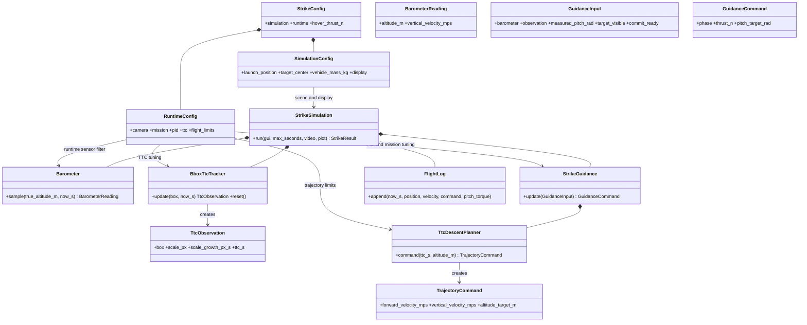
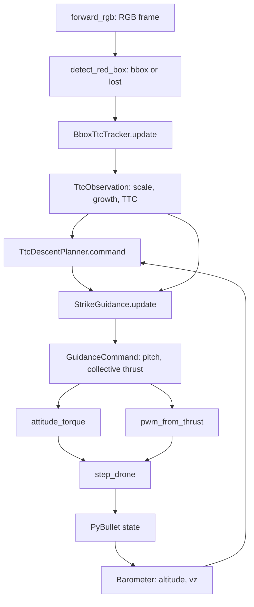
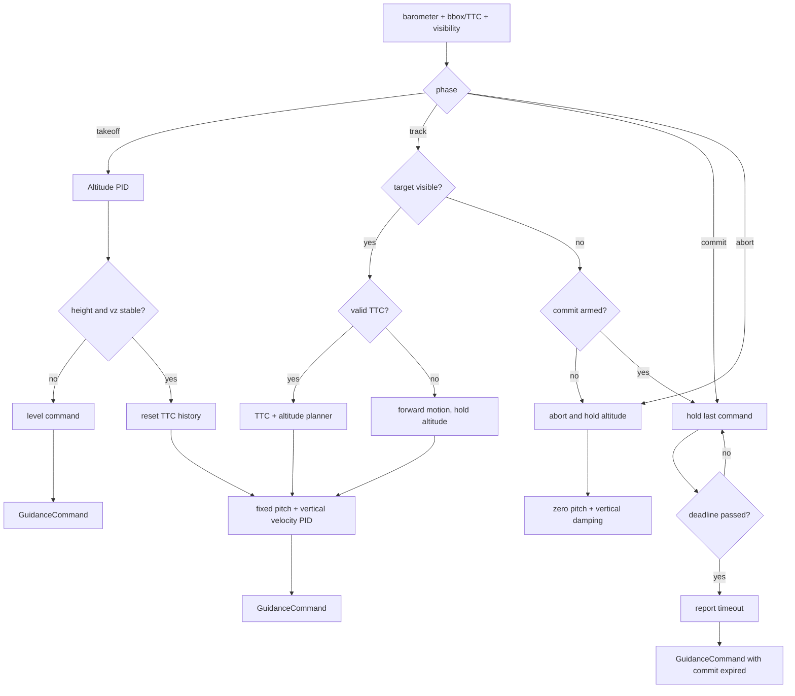

# TTC diagonal-strike package

This Module 7 proof of concept takes off to 15 m, detects a red cube, estimates
time-to-contact (TTC) from bounding-box growth, synchronises its descent to the
known impact altitude, and records the contact. The controller does **not** need
the cube's metric size, image centre, focal length, or world position. Those
values exist only in `SimulationConfig` so the simulator can spawn and draw a
target.
Roll and yaw remain zero in this first exercise.

Run it with:

```bash
uv run python examples/07-optical-navigation/ttc_diagonal_strike.py
```

For the complete command, YAML, output, and troubleshooting guide, see
[`ttc_strike_usage.md`](../ttc_strike_usage.md).

### Scenario YAML

Initial conditions can be changed without editing Python. The sample
`scenario.yaml` groups simulator setup separately from field-tunable runtime
parameters:

```yaml
simulation:
  scene:
    launch_position: [-5.25, 0.0, 0.05]
    target_center: [20.0, 0.0, 1.0]
runtime:
  mission:
    takeoff_altitude_m: 15.0
  ttc:
    commit_box_height_fraction: 0.1
```

Run it with:

```bash
uv run python examples/07-optical-navigation/ttc_diagonal_strike.py \
  --config examples/07-optical-navigation/ttc_strike/scenario.yaml
```

For the shorter 30 m test, use
`examples/07-optical-navigation/ttc_strike_inputs/30m_diagonal_strike.yaml`:

```bash
uv run python examples/07-optical-navigation/ttc_diagonal_strike.py \
  --config examples/07-optical-navigation/ttc_strike_inputs/30m_diagonal_strike.yaml
```

`box.position` changes only where the simulator spawns the visual target;
the controller still uses image measurements and TTC. The YAML does not
change the existing 1 m impact altitude. For a distant target, lower
`commit_box_height_fraction` so a small bbox can enter the commit phase before
leaving the camera view. The resolved values and source path are recorded in
each run's `settings.json`.

The complete commented schema is in
`examples/07-optical-navigation/ttc_strike_inputs/template.yaml`. The loader
creates `SimulationConfig` and `RuntimeConfig` independently, then composes
them into `StrikeConfig`; the simulator and controllers receive typed config,
not YAML parsing responsibilities.

## Module design

```text
ttc_strike/
├── config.py       SimulationConfig + RuntimeConfig + StrikeConfig
├── config_loader.py grouped YAML parser and validation
├── sensing.py      Barometer: altitude and vertical velocity
├── ttc.py          BboxTtcTracker: bbox scale growth to TTC
├── trajectory.py   TtcDescentPlanner: TTC + altitude to vx/vz target
├── guidance.py     StrikeGuidance: takeoff, track, commit, abort
├── telemetry.py    FlightLog: live graph and final PNG
├── views.py        camera overlays and wide environment rendering
├── simulation.py   StrikeSimulation: the PyBullet adapter
└── cli.py          command-line options and self-check
```

Only `simulation.py` knows PyBullet/OpenCV. The calculation modules receive
plain typed data, which keeps TTC and trajectory math easy to test.

## Class relationships



| Class | Role |
| --- | --- |
| `SimulationConfig` | Simulator scene, vehicle model, synthetic sensors, display, and recording defaults. |
| `RuntimeConfig` | Physical camera setup, mission targets, TTC tuning, limits, filters, and PID gains. |
| `StrikeConfig` | Composes the two independent configuration groups. |
| `Barometer` | Samples altitude and filters vertical velocity. |
| `BboxTtcTracker` | Converts bbox scale growth into TTC and commit readiness. |
| `TtcObservation` | Typed visual measurement: box, scale, growth, and TTC. |
| `TtcDescentPlanner` | Uses TTC as time-to-go for the known impact altitude. |
| `StrikeGuidance` | Selects takeoff, track, commit, or abort and emits high-level commands. |
| `StrikeSimulation` | Connects sensing, guidance, motor helpers, rendering, and contact. |

## TTC and altitude math

The detector supplies only a rectangle. Let `s = sqrt(width_px * height_px)`.
Approach is the positive filtered growth `g = (s_now - s_previous) / dt`, and
`TTC = s / g`.

No target size or camera calibration is required. During tracking the planner
uses barometer altitude `h` and known impact altitude `h*`:

`v_z* = clamp((h* - h) / max(TTC, min_TTC), -max_descent, max_climb)`.

Before a valid TTC exists, the drone keeps nominal forward velocity and holds
altitude while moving forward to create measurable bbox growth.

## Configuration reference

`SimulationConfig.target_center` and `SimulationConfig.target_size_m` are
fixture values only; changing them must not change the controller equations.
`RuntimeConfig` contains the camera setup and values that should be calibrated
against a real vehicle.

| Field | Default | Meaning |
| --- | --- | --- |
| `takeoff_altitude_m` | `15.0` | Height at which tracking starts. |
| `impact_altitude_m` | `1.0` | Desired altitude at contact. |
| `forward_speed_mps` | `13.0` | Nominal body-forward command. |
| `nominal_pitch_deg` | `20.0` | Initial forward pitch while altitude is held. |
| `max_descent_velocity_mps` | `4.5` | Downward velocity limit used after TTC becomes valid. |
| `max_climb_velocity_mps` | `3.0` | Upward velocity limit. |
| `camera_fov_deg` | `90.0` | Rendering FOV only; not a TTC range scale. |
| `commit_box_height_fraction` | `0.1` | Image-height threshold that arms commit. |
| `ttc_growth_old_weight` | `0.65` | Smoothing weight for bbox growth. |
| `min_growth_px_per_s` | `0.01` | Rejects zero/negative approach growth. |
| `commit_timeout_margin_s` | `5.0` | Extra time after the last TTC during commit. |
| `post_impact_seconds` | `3.0` | Time recorded after contact. |

`pitch_attitude_pid_gains` is tuned for this strike example as
`(0.008, 0.0, 0.006)`. It is separate from the shared attitude defaults used
by the other examples. Collective thrust uses measured pitch so attitude lag
does not silently remove vertical lift.

`forward_speed_pid_gains` controls the pitch response that tracks the forward
velocity target; `max_pitch_deg` limits the requested tilt.

The remaining fields tune mass/gravity, barometer noise, PID gains, window
placement, video resolution, and output paths. Contact is the headless success
condition; impact speed is reported for analysis rather than used as a hidden
pass/fail gate.

Every run creates a unique folder under `outputs/ttc_runs/` containing
`settings.json`, `telemetry.csv`, and `telemetry.png` (plus `environment.mp4`
unless disabled). Use `--run-name name` for a readable folder or `--output-root`
to select another comparison directory. Use `--csv path` or `--no-csv`; columns include phase, measured position/velocity,
trajectory velocity targets, altitude target, thrust, commanded/measured pitch,
pitch error, and pitch torque. This makes the initial forward-pitch/altitude-
hold interval easy to inspect before tuning.

The same folder contains `summary.json` and the console prints its key values:
starting pose, target pose and size, collision time and position, incoming
hitting velocity, impact speed, altitude extrema, and maximum forward speed.
The velocity and guidance plots shade the tracking interval only up to the
collision marker. The `TrajectoryCommand` plot is intentionally left unshaded
so its command curves remain easy to read.

## TTC-to-drone-step flow



`commit` holds the last valid pitch/thrust command until contact or its TTC
deadline. After contact, thrust and torque are set to zero for the configured
aftermath window. The wide PyBullet camera is only a scene view; the controller
uses the body-fixed forward camera.

## `StrikeGuidance.update()` phase flow


