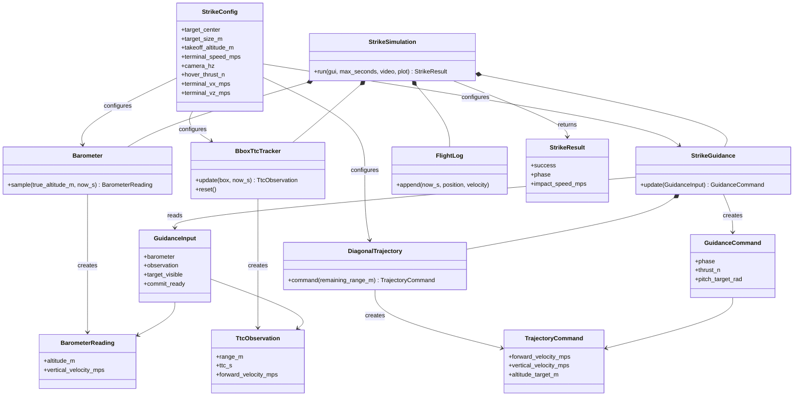
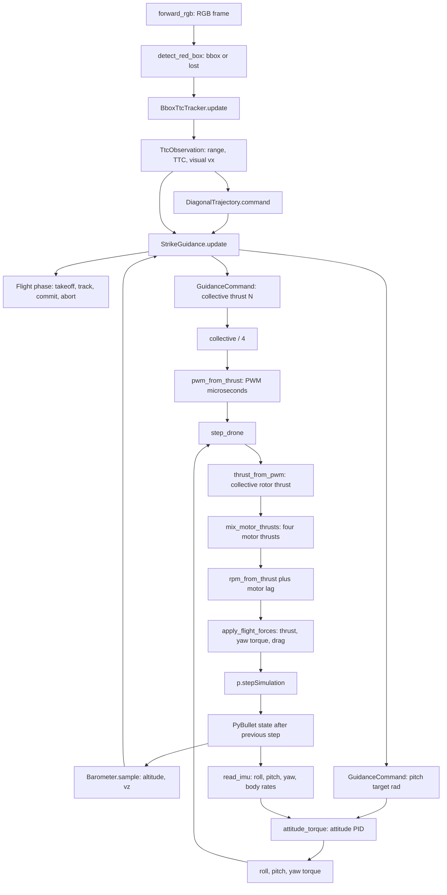
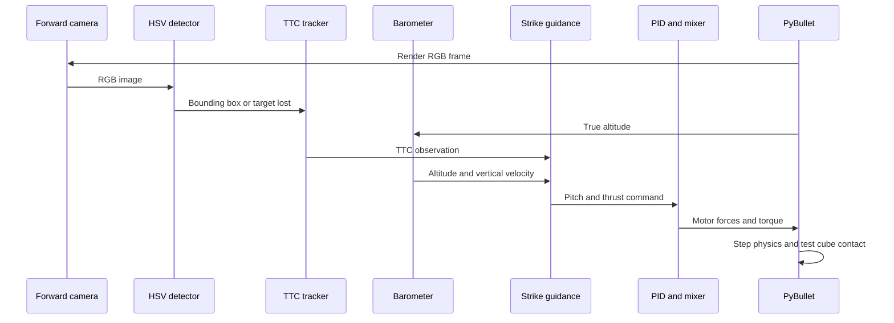

# TTC diagonal-strike package

This package is the implementation of the Module 7 proof of concept. A drone
takes off to 15 m, estimates the red cube's time to contact (TTC) from bounding
box growth, follows a 30-degree diagonal path, then intentionally collides with
the cube. Roll and yaw stay at zero. The camera is stabilized on the target so
body pitch does not remove the cube from view in this first exercise.

Run it through the compatibility wrapper:

```bash
uv run python examples/07-optical-navigation/ttc_diagonal_strike.py
```

## Module design

```text
ttc_strike/
├── config.py       StrikeConfig: values and derived geometry
├── sensing.py      Barometer: altitude and vertical velocity
├── ttc.py          BboxTtcTracker: image scale to TTC/range
├── trajectory.py   DiagonalTrajectory: range to vx/vz/altitude target
├── guidance.py     StrikeGuidance: phases plus pitch/thrust command
├── telemetry.py    FlightLog: live graph and final PNG
├── views.py        camera overlays and wide environment rendering
├── simulation.py   StrikeSimulation: the PyBullet adapter
└── cli.py          command-line options and self-check
```

The calculation modules receive typed data and configuration; they do not call
PyBullet or OpenCV. `StrikeSimulation` is the one concrete adapter that joins
camera, detector, sensor, guidance, motor mixer, video, and physics. This keeps
the TTC math testable and gives each module one reason to change without adding
unused abstract interfaces.

## Class relationships



| Class | Role | Does not own |
| --- | --- | --- |
| `StrikeConfig` | Immutable scenario settings and derived flight geometry. | Runtime state, rendering, or motor commands. |
| `Barometer` | Fixed-rate altitude sampling, optional noise/bias, and filtered `vz`. | PyBullet state access or guidance decisions. |
| `BarometerReading` | Typed altitude and vertical-velocity measurement passed between modules. | Sensor filtering or control logic. |
| `BboxTtcTracker` | Converts bbox scale growth into range, TTC, visual `vx`, and commit readiness. | Flight phases, PID, or actuation. |
| `TtcObservation` | Typed visual TTC/range result from the tracker. | Image processing or command generation. |
| `DiagonalTrajectory` | Turns remaining visual range into the desired diagonal `vx`, `vz`, and altitude. | Camera handling, phase transitions, or motor output. |
| `TrajectoryCommand` | Typed desired trajectory point for one control update. | PID state or physics stepping. |
| `StrikeGuidance` | Selects takeoff, track, commit, or abort and produces high-level pitch/thrust commands. | PyBullet, OpenCV, and per-motor mixing. |
| `GuidanceInput` | Groups the current barometer/TTC/visibility inputs for guidance. | Calculations or mutable state. |
| `GuidanceCommand` | Carries the selected phase, collective thrust, pitch target, and trajectory. | Applying forces or rendering. |
| `FlightLog` | Stores measured state plus trajectory and guidance commands for live/final plots. | Flight control or simulator state. |
| `StrikeSimulation` | Concrete PyBullet adapter that orchestrates sensing, guidance, motor helpers, contact, video, and plots. | TTC math details or PID policy internals. |
| `StrikeResult` | Final success, phase, timing, impact-speed, and output-path summary. | Simulation cleanup or plotting. |

## TTC math

| Quantity | Calculation | Meaning |
| --- | --- | --- |
| Box scale | `sqrt(width_px * height_px)` | One size value from the red bbox. |
| Scale growth | `(scale_now - scale_previous) / dt` | Positive when the drone approaches. |
| Range | `focal_pixels * target_size_m / scale` | Monocular range estimate using known cube size. |
| TTC | `scale / filtered_growth` | Estimated seconds to visual contact. |
| Visual forward speed | `range / TTC` | Estimated closing speed along camera forward. |

## Configuration reference

`StrikeConfig` is immutable. Change values by constructing a new instance in a
future experiment; values marked **derived** are read-only properties.

| Field | Default | Unit | Description |
| --- | --- | --- | --- |
| `target_center` | `(20, 0, 1)` | m | World position of the red cube center. |
| `target_size_m` | `2.0` | m | Red cube edge length used by TTC range estimation. |
| `launch_position` | `(-5.25, 0, 0.05)` | m | Initial world position of the drone. |
| `vehicle_mass_kg` | `0.65` | kg | Vehicle mass used by high-level hover-thrust calculations; keep it aligned with the URDF. |
| `gravity_mps2` | `9.81` | m/s² | Positive gravity magnitude used for hover thrust. |
| `takeoff_altitude_m` | `15.0` | m | Height reached before diagonal tracking starts. |
| `descent_angle_deg` | `30.0` | deg | Downward angle of the desired path. |
| `terminal_speed_mps` | `15.0` | m/s | Desired total speed at target contact. |
| `camera_width_px` | `640` | px | Forward-camera image width. |
| `camera_height_px` | `480` | px | Forward-camera image height and TTC focal basis. |
| `camera_hz` | `30` | Hz | Camera, barometer, video, and live-plot update rate. |
| `camera_fov_deg` | `60.0` | deg | Forward-camera vertical field of view. |
| `commit_box_height_fraction` | `0.5` | fraction | Bbox-height fraction that arms terminal command hold. |
| `ttc_growth_old_weight` | `0.65` | fraction | Weight retained from the prior bbox-growth estimate. |
| `min_growth_px_per_s` | `0.01` | px/s | Minimum positive growth accepted as approach motion. |
| `barometer_noise_sigma_m` | `0.0` | m | Standard deviation of deterministic altitude noise. |
| `barometer_bias_m` | `0.0` | m | Constant altitude-measurement offset. |
| `barometer_velocity_old_weight` | `0.7` | fraction | Weight retained from prior filtered vertical velocity. |
| `random_seed` | `7` | — | Seed for repeatable barometer noise. |
| `altitude_pid_gains` | `(0.7, 0.05, 1.1)` | N/m, N/(m·s), N·s/m | Takeoff altitude PID `(Kp, Ki, Kd)`. |
| `altitude_integral_limit` | `0.5` | controller units | Clamp for altitude PID integral state. |
| `forward_pid_gains` | `(0.08, 0, 0)` | rad/(m/s) | Forward-speed-error PID used as pitch correction. |
| `vertical_velocity_pid_gains` | `(0.7, 0, 0)` | N/(m/s) | Vertical-velocity-error PID gains. |
| `vertical_position_correction` | `0.8` | 1/s | Altitude error contribution added to desired vertical velocity. |
| `max_pitch_deg` | `30.0` | deg | Maximum forward pitch command. |
| `takeoff_altitude_tolerance_m` | `0.2` | m | How close to takeoff target before tracking can begin. |
| `takeoff_velocity_tolerance_mps` | `0.5` | m/s | Required vertical-speed magnitude before tracking can begin. |
| `commit_timeout_margin_s` | `0.5` | s | Extra time allowed after predicted TTC in commit phase. |
| `post_impact_seconds` | `3.0` | s | Physics/video time retained after first collision. |
| `accepted_impact_speed_mps` | `(10, 20)` | m/s | Inclusive headless-pass impact-speed range. |
| `environment_size_px` | `(960, 540)` | px | Fixed wide-camera video resolution. |
| `opencv_window_position_px` | `(20, 80)` | screen px | Top-left position of the forward-camera OpenCV window. |
| `plot_window_position_px` | `(700, 80)` | screen px | Top-left position of the live telemetry plot window. |

The default positions place the 640 px-wide camera window at the left and the
telemetry plot beside it. Change these two fields in `StrikeConfig` for a
different monitor arrangement.

| Derived property | Calculation | Description |
| --- | --- | --- |
| `target_face_x_m` | `target_center.x - target_size_m / 2` | Near face used for the planned strike range. |
| `hover_thrust_n` | `vehicle_mass_kg * gravity_mps2` | Collective force that balances gravity. |
| `descent_angle_rad` | radians of `descent_angle_deg` | Internal trigonometric angle. |
| `terminal_vx_mps`, `terminal_vz_mps` | speed resolved along path | Expected terminal forward and down velocities. |
| `path_length_m`, `path_acceleration_mps2` | target geometry and terminal speed | Constant-acceleration diagonal-path quantities. |
| `initial_range_m` | target face minus launch `x` | Fallback visual range before TTC becomes valid. |
| `commit_box_height_px` | image height × commit fraction | Pixel threshold that arms commit. |
| `max_pitch_rad` | radians of max pitch | Internal attitude-command limit. |

## TTC-to-drone-step flow

The TTC module only estimates visual motion. `StrikeGuidance` converts that
estimate and barometer data into high-level commands. The existing shared motor
helpers then convert those commands into forces before PyBullet advances one
physics step.



`commit` deliberately bypasses fresh vision commands and reuses the last valid
pitch and collective-thrust command until contact or the TTC deadline. After
contact, the simulation sets collective thrust and torque to zero, records the
three-second aftermath, and stops.

## One control cycle


