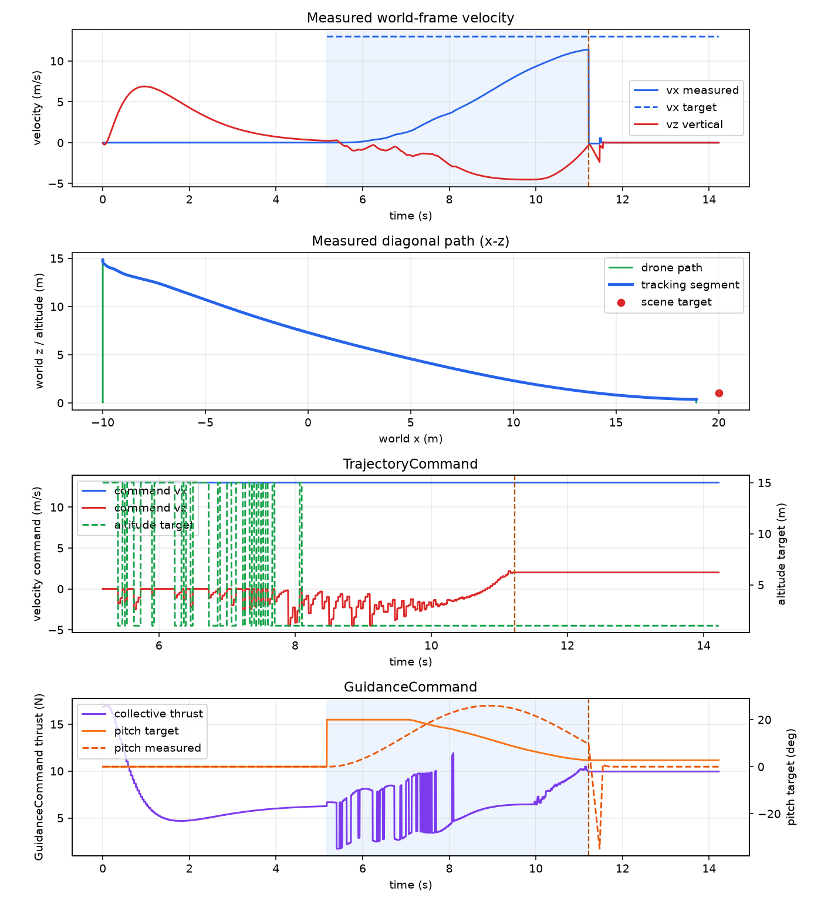
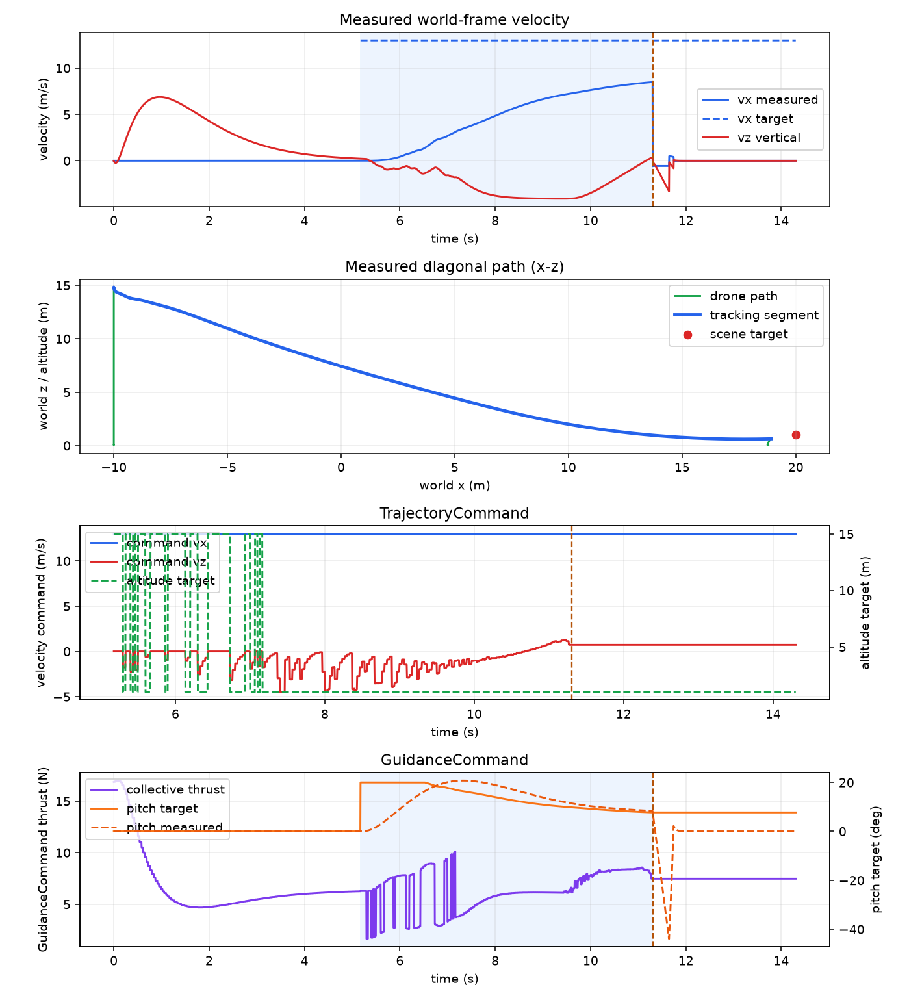

# TTC pitch-response comparison — 30 m diagonal strike

**Date:** 2026-09-25  
**Scenario:** `examples/07-optical-navigation/ttc_strike_inputs/30m_diagonal_strike.yaml`  
**Baseline (left):** raw run `run-20260925-002946-257684`, archived as `baseline-pre-tune`  
**New run (right):** raw run `run-20260925-070703-666367`, archived as `tuned-pitch-pid`

## Objective

Measure whether the TTC strike drone follows the commanded pitch faster and
with less overshoot after tuning the pitch attitude PID. Both runs use the same
30 m scene, takeoff altitude, target, TTC settings, forward-speed command, and
altitude controller. The intentional change is the TTC-specific attitude pitch
PID and measured-pitch thrust compensation.

## Test setup

| Parameter | Value |
| --- | ---: |
| Drone start | `(-10.0, 0.0, 0.05) m` |
| Target center | `(20.0, 0.0, 1.0) m` |
| Horizontal distance | `30 m` |
| Target size | `2.0 m` cube |
| Takeoff altitude | `15.0 m` |
| Impact altitude | `1.0 m` |
| Forward velocity command | `13.0 m/s` |
| Commit threshold | `4%` of image height |
| Camera | `640 × 480`, `30 Hz`, `90° FOV` |

## PID settings

| Controller | Baseline | Tuned | Integral limit / related setting |
| --- | --- | --- | --- |
| Altitude | `(0.7, 0.05, 1.1)` | `(0.7, 0.05, 1.1)` | `0.5` |
| Forward-speed-to-pitch | `(0.03, 0.0, 0.002)` | `(0.03, 0.0, 0.002)` | `0.2` |
| Vertical velocity | `(1.0, 0.0, 0.0)` | `(1.0, 0.0, 0.0)` | no integral limit configured |
| Attitude pitch | `(0.002, 0.0, 0.001)` shared default | `(0.008, 0.0, 0.006)` TTC-specific | no integral term |
| Vertical position correction | `0.8` | `0.8` | applied beside vertical-velocity PID |

The baseline settings file predates the TTC-specific pitch field, so its
attitude values are taken from the shared `make_controllers()` default. The
tuned settings file records the new gains explicitly.

## Side-by-side telemetry plots

The baseline is on the left; the newer tuned run is on the right. The
`GuidanceCommand` panel at the bottom is the primary pitch-response view.

<table>
<tr>
<th>Baseline — pre-tune</th>
<th>New run — tuned pitch PID</th>
</tr>
<tr>
<td></td>
<td></td>
</tr>
</table>

## Results

| Metric | Baseline | Tuned | Change |
| --- | ---: | ---: | ---: |
| Target contacted | Yes | Yes | unchanged |
| Collision time | `11.221 s` | `11.304 s` | `+0.083 s` |
| Maximum measured pitch | `25.97°` | `20.76°` | `−5.21°` |
| Time to measured `5°` | `1.029 s` | `0.567 s` | `−0.462 s` |
| Time to measured `10°` | `1.533 s` | `0.879 s` | `−0.654 s` |
| Time to measured `15°` | `1.996 s` | `1.229 s` | `−0.767 s` |
| Time to measured `19°` | `2.392 s` | `1.633 s` | `−0.759 s` |
| Maximum pitch error | `16.07°` undershoot | `5.03°` undershoot | substantially reduced |
| Maximum forward speed | `11.41 m/s` | `8.50 m/s` | `−2.91 m/s` |
| Impact speed | `11.41 m/s` | `8.51 m/s` | `−2.91 m/s` |
| Maximum altitude | `14.87 m` | `14.84 m` | effectively unchanged |

## Interpretation

The tuned run responds faster: it reaches each pitch milestone sooner and
peaks at only about `20.8°`, close to the `20°` command limit. The baseline
continues rotating after its command starts falling and reaches almost `26°`.

The lower impact speed is the main trade-off. The tuned attitude loop follows
the changing pitch target more closely, so it does not hold the high pitch long
enough to build the same forward speed. The target is still contacted, and the
takeoff altitude is essentially unchanged.

The tuned implementation also uses measured pitch for vertical-thrust
compensation and records `pitch_error_deg` and `pitch_torque` in the CSV. These
fields make the next tuning pass measurable instead of relying only on the
rendered plot.

## Archived artifacts

- [Baseline settings](baseline-pre-tune/settings.json) · [summary](baseline-pre-tune/summary.json) · [CSV](baseline-pre-tune/telemetry.csv) · [plot](baseline-pre-tune/telemetry.png)
- [Tuned settings](tuned-pitch-pid/settings.json) · [summary](tuned-pitch-pid/summary.json) · [CSV](tuned-pitch-pid/telemetry.csv) · [plot](tuned-pitch-pid/telemetry.png)

## Conclusion and next step

Keep the tuned pitch gains for the TTC example. The next experiment should
evaluate whether the reduced impact speed is desirable, then tune the
forward-speed-to-pitch controller separately rather than increasing attitude
gains again.
